# Academic Workspace - TERM-3 SY-2024-25

**Program**: BS IT Network & Cybersecurity  
**Institution**: [Your Institution]  
**Term**: TERM-3 SY-2024-25  
**Workspace Type**: Comprehensive Academic & Professional Development Ecosystem

---

## 🎯 Workspace Overview

This workspace represents a complete transformation of GitHub and VS Code into a comprehensive academic ecosystem, specifically designed for BS IT Network & Cybersecurity studies. It integrates AI-first organization, automated workflows, privacy compliance, and professional portfolio development into a single, cohesive learning and development platform.

### Key Features

- **🤖 AI-Optimized Structure**: Every aspect designed for seamless AI assistant navigation and collaboration
- **⚡ Automated Workflows**: GitHub Actions for task generation, progress tracking, and portfolio updates
- **🔒 Privacy Compliant**: School regulation adherence with public portfolio capability
- **💼 Career-Focused**: Professional development integrated throughout academic work
- **🤝 Collaboration-Ready**: Systematic feedback collection and testimonial gathering

---

## 📚 Course Structure

### TERM-3 SY-2024-25 Courses

| Course Code | Course Name | Focus Areas | Portfolio Status |
|-------------|-------------|-------------|------------------|
| **MO-IT103** | Computer Programming 2 | Advanced Programming, Web Development, Database Integration | 🔄 Developing |
| **MO-IT143** | Ethical Hacking | Penetration Testing, Security Assessment, Vulnerability Analysis | 🔄 Developing |
| **MO-IT147** | Information Assurance and Security 1 | Risk Assessment, Security Policies, Compliance Frameworks | 🔄 Developing |
| **MO-IT148** | Applications Development and Emerging Technologies | Modern Frameworks, Cloud Solutions, AI/ML Integration | 🔄 Developing |
| **MO-IT151** | Platform Technologies | Cloud Platforms, DevOps, Infrastructure Automation | 🔄 Developing |

### Course Directory Structure

Each course follows a standardized structure:

```
courses/[COURSE-CODE]-[COURSE-NAME]/
├── README.md                    # Course overview and objectives
├── assignments/                 # Course assignments and homework
├── projects/                   # Major course projects
├── notes/                      # Study notes and class materials
└── portfolio-items/            # Professional portfolio showcases
```

---

## 🗂️ Workspace Organization

### Main Directory Structure

```
TERM-3_SY-2024-25/
├── 📁 courses/                 # All course materials (5 courses)
├── 📁 portfolio/               # Professional portfolio development
│   ├── achievements/           # Academic and professional achievements
│   ├── projects/              # Showcase projects across courses
│   ├── skills/                # Technical skills matrix
│   └── testimonials/          # Collected feedback and recommendations
├── 📁 templates/              # Standardized templates for consistency
│   ├── assignment-template.md
│   ├── project-template.md
│   ├── notes-template.md
│   ├── portfolio-item-template.md
│   └── testimonial-collection-template.md
├── 📁 documentation/          # Project documentation and progress tracking
│   ├── workspace-progress.md
│   ├── collaboration-session-summary.md
│   └── comprehensive-project-report.md
├── 📁 automation/             # Automated workflows and scripts
│   ├── workflows/             # GitHub Actions workflows
│   └── scripts/               # Python automation scripts
├── 📁 mcp/                    # MCP Memory Knowledge Graph
│   └── memory/                # Persistent knowledge storage
└── 📁 .github/workflows/      # GitHub Actions automation
```

---

## 🤖 AI Integration & MCP Memory

### MCP Memory Knowledge Graph

This workspace uses Model Context Protocol (MCP) memory tools for persistent context and collaboration:

- **📊 Knowledge Graph**: Maintains relationships between courses, projects, and progress
- **🧠 Persistent Memory**: Retains context across AI collaboration sessions
- **🔗 Smart Connections**: Links related academic content and professional development
- **📈 Progress Tracking**: Monitors academic and portfolio development over time

### AI-First Design Principles

- **Descriptive Naming**: All files and folders use clear, searchable names
- **Structured Documentation**: Consistent templates and formatting for AI navigation
- **Cross-Referencing**: Strategic linking between related content
- **Metadata Integration**: JSON frontmatter and tags for enhanced AI understanding

---

## 🧠 AI-Powered Knowledge Management

This workspace uses **MCP Memory Knowledge Graph** to maintain intelligent context about your entire academic journey. Here's how it enhances your learning experience:

```mermaid
graph LR
    subgraph "Your Learning Journey"
        A[📚 Course Work] --> B[🧠 MCP Memory]
        C[🚀 Projects] --> B
        D[📝 Assignments] --> B
        E[💼 Portfolio] --> B
    end
    
    subgraph "AI Context Engine"
        B --> F[🤖 GitHub Copilot]
        F --> G[Cross-Course Connections]
        F --> H[Progress Tracking]
        F --> I[Skill Development]
    end
    
    subgraph "Smart Assistance"
        G --> J[🎯 Relevant Suggestions]
        H --> K[📊 Progress Reports]
        I --> L[💡 Learning Insights]
    end
    
    style A fill:#e1f5fe
    style C fill:#e8f5e8
    style F fill:#f3e5f5
    style J fill:#fff3e0
```



### What This Means for You

- **🔗 Connected Learning**: Copilot understands how your courses relate to each other
- **📈 Progress Awareness**: AI tracks your development across all subjects
- **💡 Smart Suggestions**: Get relevant examples from your own work
- **🎯 Portfolio Integration**: Automatic connection between coursework and career development

---

## ⚡ Automation & Workflows

### GitHub Actions Workflows

#### 1. Weekly Task Generator
- **Schedule**: Every Monday at 9 AM
- **Function**: Creates weekly tasks for all 5 courses
- **Features**: Auto-labeling, project board integration, deadline tracking

#### 2. Project Board Management
- **Triggers**: Issue/PR events, weekly schedule
- **Function**: Automatic project board updates and progress categorization
- **Features**: Course-based labeling, status tracking, weekly summaries

#### 3. Portfolio Auto-Update
- **Triggers**: Portfolio item changes, weekly schedule
- **Function**: Automatically updates portfolio index and skills matrix
- **Features**: Content scanning, skills extraction, professional formatting

#### 4. Feedback Collection
- **Schedule**: Every Wednesday at 4 PM
- **Function**: Automated feedback request generation
- **Features**: Multiple feedback types, follow-up reminders, testimonial tracking

#### 5. Milestone Tracking
- **Schedule**: Monday, Wednesday, Friday at 8 AM
- **Function**: Progress monitoring and achievement recognition
- **Features**: Completion metrics, achievement badges, progress visualization

### Automation Scripts

#### Portfolio Updater (`automation/scripts/portfolio_updater.py`)
- Scans course portfolio items
- Updates main portfolio README
- Generates skills matrix
- Creates progress reports

#### Course Progress Tracker (`automation/scripts/course_progress_tracker.py`)
- Monitors course directory activity
- Calculates completion metrics
- Generates progress reports
- Provides quick status summaries

---

## 💼 Portfolio Development

### Professional Portfolio Structure

The portfolio system transforms academic work into professional showcases:

#### Portfolio Components

1. **🏆 Achievements**: Academic milestones and professional recognitions
2. **🚀 Projects**: Showcase projects demonstrating technical competency
3. **🛠️ Skills**: Technical skills matrix with proficiency levels
4. **💬 Testimonials**: Collected feedback from instructors and peers

#### Portfolio Integration

- **Automatic Updates**: Portfolio content updates based on course progress
- **Skills Tracking**: Dynamic skills matrix based on completed work
- **Professional Formatting**: Industry-standard presentation for career development
- **Cross-Course Integration**: Demonstrates skill development across curriculum

### Career Development Features

- **Industry Alignment**: Portfolio items mapped to industry requirements
- **Professional Standards**: Academic work presented at professional quality
- **Networking Support**: Testimonial collection and recommendation workflows
- **Job Readiness**: Comprehensive showcase for career transition

---

## 🔒 Privacy & Compliance

### School Regulation Compliance

- **Academic Privacy**: Private academic materials separated from public portfolio
- **Intellectual Property**: Proper attribution and compliance with institutional policies
- **Access Control**: Appropriate sharing and collaboration permissions
- **Professional Presentation**: Public portfolio suitable for career development

### Implementation Strategy

- **Git Submodules**: Separate private academic materials from public portfolio
- **Selective Sharing**: Strategic publication of appropriate academic work
- **Compliance Documentation**: Clear guidelines for content sharing
- **Privacy Controls**: Granular access management for different content types

---

## 🤝 Collaboration & Feedback

### Feedback Collection System

#### Multi-Channel Approach
- **GitHub Issues**: Structured feedback collection
- **GitHub Discussions**: Community interaction and peer feedback
- **LinkedIn Integration**: Professional recommendation workflows
- **Direct Communication**: Email and meeting-based feedback

#### Systematic Testimonial Collection
- **Course Instructors**: Academic performance testimonials
- **Project Partners**: Collaboration and teamwork feedback
- **Industry Mentors**: Professional development guidance
- **Peer Reviews**: Student collaboration testimonials

### Collaboration Features

- **Team Project Support**: Structured collaboration workflows
- **Peer Review Systems**: Systematic feedback exchange
- **Professional Networking**: LinkedIn and industry connection building
- **Community Engagement**: Course and program community participation

---

## 📈 Progress Tracking & Analytics

### Automated Progress Monitoring

#### Key Metrics
- **Course Completion**: Progress across all 5 courses
- **Portfolio Development**: Professional showcase creation
- **Skill Development**: Technical competency growth
- **Academic Excellence**: Quality and consistency metrics

#### Reporting Systems
- **Daily Summaries**: Quick progress overview
- **Weekly Reports**: Detailed progress analysis
- **Monthly Assessments**: Comprehensive performance review
- **Term Evaluations**: Overall academic and professional development

### Achievement Recognition

- **Milestone Badges**: Automated achievement recognition
- **Progress Visualization**: Graphical progress representation
- **Completion Tracking**: Course and portfolio completion status
- **Excellence Recognition**: Academic and professional achievement highlighting

---

## 🚀 Getting Started

### Initial Setup

1. **Clone Repository**: Download complete workspace structure
2. **Configure MCP Memory**: Set up persistent knowledge graph
3. **Review Course Objectives**: Understand requirements for all 5 courses
4. **Setup Development Environment**: Configure VS Code with necessary extensions
5. **Initialize GitHub Actions**: Enable automated workflow systems

### Daily Workflow

1. **Check Progress Summary**: Review automated progress reports
2. **Update Course Materials**: Add assignments, notes, projects
3. **Develop Portfolio Items**: Create professional showcases
4. **Engage with Automation**: Leverage GitHub Actions for efficiency
5. **Collect Feedback**: Participate in systematic feedback collection

### Weekly Routines

1. **Review Weekly Tasks**: Complete automated task generation
2. **Update Portfolio**: Enhance professional presentation
3. **Progress Assessment**: Analyze automated progress reports
4. **Feedback Integration**: Incorporate received feedback
5. **Plan Upcoming Work**: Strategic planning for next week

---

## 🛠️ Technical Documentation

### System Requirements

- **Git**: Version control and collaboration
- **VS Code**: Primary development environment
- **Python**: Automation script execution
- **GitHub Account**: Repository hosting and actions
- **MCP-Compatible AI**: Memory and collaboration features

### Key Technologies

- **GitHub Actions**: Workflow automation
- **Python Scripts**: Custom automation tools
- **Markdown**: Documentation and content creation
- **JSON**: Metadata and configuration management
- **Git Submodules**: Privacy and content separation

### Maintenance

- **Weekly**: Review and update automation workflows
- **Monthly**: Assess and optimize workspace organization
- **Term End**: Comprehensive evaluation and improvement planning
- **Ongoing**: Continuous integration of feedback and improvements

---

## 📞 Support & Resources

### Documentation

- **Course READMEs**: Detailed course information and objectives
- **Template Library**: Standardized templates for consistent quality
- **Automation Guides**: Workflow and script documentation
- **Progress Reports**: Automated tracking and analysis tools

### Community

- **GitHub Discussions**: Workspace community interaction
- **Issue Tracking**: Bug reports and feature requests
- **Feedback Systems**: Continuous improvement input
- **Professional Networking**: Career development connections

### Technical Support

- **GitHub Actions**: Automated workflow troubleshooting
- **MCP Memory**: Knowledge graph and memory management
- **Script Execution**: Python automation support
- **Integration Issues**: VS Code and tool integration

---

## 📊 Success Metrics

### Academic Excellence

- **Course Completion**: 100% completion rate across all 5 courses
- **Quality Standards**: Professional-grade academic work
- **Skill Development**: Comprehensive technical competency growth
- **Portfolio Quality**: Industry-ready professional showcase

### Professional Development

- **Portfolio Completeness**: Comprehensive professional presentation
- **Industry Readiness**: Job-market preparation
- **Networking Success**: Professional connection development
- **Career Transition**: Successful industry entry preparation

### System Effectiveness

- **Automation Efficiency**: Workflow time savings and consistency
- **Collaboration Quality**: Feedback and testimonial collection success
- **Privacy Compliance**: School regulation adherence
- **Innovation Integration**: Emerging technology adoption

---

## 🎓 Academic Program Context

### BS IT Network & Cybersecurity

This workspace specifically supports the BS IT Network & Cybersecurity program with:

- **Technical Skill Development**: Programming, security, and infrastructure competencies
- **Industry Preparation**: Real-world application of academic learning
- **Professional Portfolio**: Career-ready showcase of technical abilities
- **Collaborative Learning**: Peer interaction and professional networking

### TERM-3 SY-2024-25 Focus

- **Advanced Programming**: Building on foundational programming knowledge
- **Cybersecurity Specialization**: Ethical hacking and security assessment
- **Information Assurance**: Risk management and compliance frameworks
- **Emerging Technologies**: Modern frameworks and cloud solutions
- **Platform Technologies**: Infrastructure and deployment strategies

---

## 📝 Contributing & Improvement

### Feedback Welcome

This workspace thrives on continuous improvement through:

- **User Feedback**: Student and instructor input
- **Technical Enhancements**: Tool and workflow improvements
- **Academic Alignment**: Curriculum and industry requirement updates
- **Innovation Integration**: New technology and methodology adoption

### Contributing Guidelines

1. **Issue Reporting**: Use GitHub Issues for bugs and feature requests
2. **Feedback Submission**: Participate in automated feedback collection
3. **Improvement Suggestions**: Propose workflow and organization enhancements
4. **Collaboration**: Engage in community discussions and peer support

---

**🎯 Vision**: Transform academic learning into professional excellence through AI-optimized organization, automated efficiency, and comprehensive portfolio development.

**📧 Contact**: [Your contact information]  
**📅 Last Updated**: June 3, 2025  
**🔄 Version**: 1.0 - Complete Implementation

---

*This workspace represents the future of academic learning - where AI assistance, automation, and professional development converge to create an optimal educational experience.*
