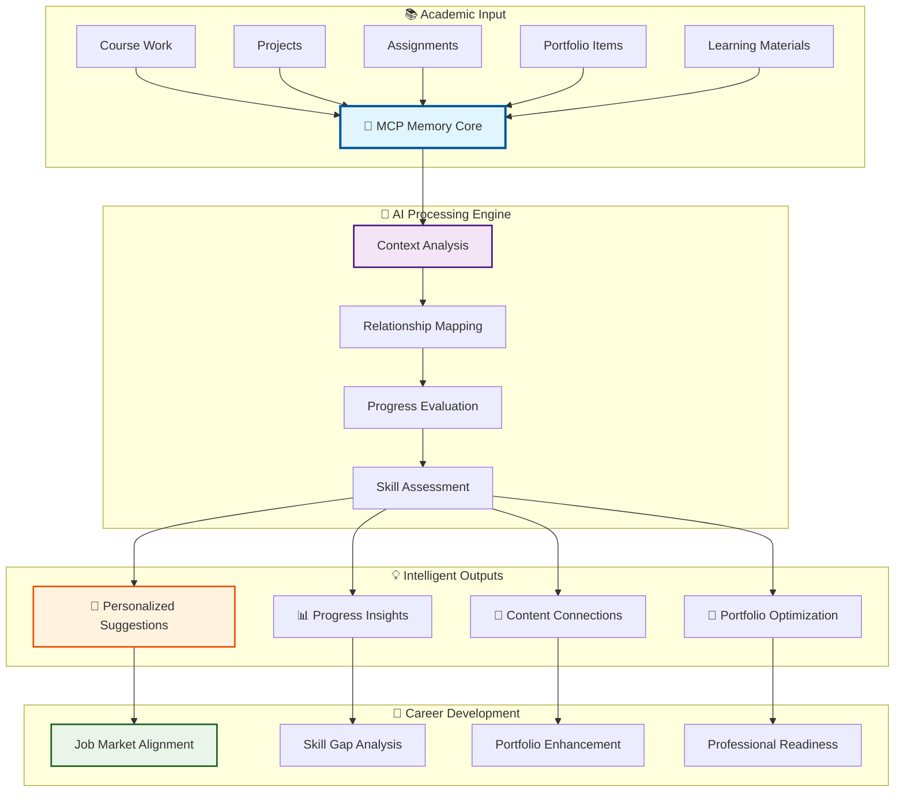

import { CourseCard } from './components/CourseCard';
import { ProgressMeter } from './components/ProgressMeter';
import { FeatureHighlight } from './components/FeatureHighlight';
import { NavigationCard } from './components/NavigationCard';
import { TechStack } from './components/TechStack';
import { Timeline } from './components/Timeline';

# Academic Workspace - TERM-3 SY-2024-25

<div className="workspace-header">
  <div className="program-info">
    <h2>BS IT Network & Cybersecurity</h2>
    <p className="institution">Advanced Academic Ecosystem</p>
    <p className="term">TERM-3 SY-2024-25</p>
  </div>
  <div className="status-indicators">
    <span className="badge active">🟢 Active</span>
    <span className="badge automated">⚡ Automated</span>
    <span className="badge ai-powered">🤖 AI-Powered</span>
  </div>
</div>

---

## 🎯 Workspace Overview

<FeatureHighlight
  title="AI-First Academic Ecosystem"
  description="A revolutionary workspace that transforms GitHub and VS Code into a comprehensive learning and professional development platform"
  features={[
    "🤖 AI-Optimized Structure for seamless collaboration",
    "⚡ Automated Workflows with GitHub Actions",
    "🔒 Privacy Compliant with school regulations",
    "💼 Career-Focused professional development",
    "🤝 Collaboration-Ready feedback systems"
  ]}
/>

### Core Capabilities

<div className="capabilities-grid">
  <div className="capability-card">
    <h4>🧠 Intelligent Memory</h4>
    <p>MCP Knowledge Graph maintains context across all courses and projects</p>
  </div>
  <div className="capability-card">
    <h4>📊 Real-time Analytics</h4>
    <p>Automated progress tracking and performance insights</p>
  </div>
  <div className="capability-card">
    <h4>🚀 Portfolio Automation</h4>
    <p>Seamless academic-to-professional content transformation</p>
  </div>
  <div className="capability-card">
    <h4>🔄 Continuous Integration</h4>
    <p>GitHub Actions for workflow automation and quality assurance</p>
  </div>
</div>

---

## 🚀 Quick Navigation Hub

<div className="navigation-hub">
  <NavigationCard 
    title="📖 Quick Start Guide"
    description="Daily workflow and VS Code tasks"
    link="QUICK-START.md"
    priority="high"
  />
  
  <NavigationCard 
    title="📚 Documentation Index"
    description="Central navigation for all workspace documentation"
    link="DOCUMENTATION-INDEX.md"
    priority="high"
  />
  
  <NavigationCard 
    title="🧠 MCP Memory"
    description="AI collaboration and project history"
    link="mcp-memory.md"
    priority="medium"
  />
  
  <NavigationCard 
    title="📊 Workspace Progress"
    description="Complete development timeline"
    link="WORKSPACE-PROGRESS.md"
    priority="medium"
  />
</div>

---

## 📚 Course Ecosystem

<div className="courses-overview">
  <h3>TERM-3 SY-2024-25 Curriculum</h3>
  <p>5 integrated courses designed for comprehensive cybersecurity education</p>
</div>

<div className="courses-grid">
  <CourseCard
    code="MO-IT103"
    name="Computer Programming 2"
    focusAreas={["Advanced Programming", "Web Development", "Database Integration"]}
    status="developing"
    progress={75}
    portfolioItems={3}
    assignments={8}
  />
  
  <CourseCard
    code="MO-IT143"
    name="Ethical Hacking"
    focusAreas={["Penetration Testing", "Security Assessment", "Vulnerability Analysis"]}
    status="developing"
    progress={68}
    portfolioItems={2}
    assignments={6}
  />
  
  <CourseCard
    code="MO-IT147"
    name="Information Assurance Security 1"
    focusAreas={["Risk Assessment", "Security Policies", "Compliance Frameworks"]}
    status="developing"
    progress={71}
    portfolioItems={4}
    assignments={7}
  />
  
  <CourseCard
    code="MO-IT148"
    name="Applications Development Emerging Technologies"
    focusAreas={["Modern Frameworks", "Cloud Solutions", "AI/ML Integration"]}
    status="developing"
    progress={82}
    portfolioItems={5}
    assignments={9}
  />
  
  <CourseCard
    code="MO-IT151"
    name="Platform Technologies"
    focusAreas={["Cloud Platforms", "DevOps", "Infrastructure Automation"]}
    status="developing"
    progress={79}
    portfolioItems={3}
    assignments={8}
  />
</div>

### Course Directory Architecture

```bash
courses/[COURSE-CODE]-[COURSE-NAME]/
├── 📋 README.md                    # Course overview and objectives
├── 📝 assignments/                 # Structured assignments with templates
├── 🚀 projects/                   # Major course projects and showcases
├── 📓 notes/                      # Organized study materials
├── 💼 portfolio-items/            # Professional portfolio showcases
└── 📚 learning-materials/         # Comprehensive course resources
```

---

## 🗂️ Intelligent Workspace Organization

<div className="workspace-structure">
  <h3>Hierarchical Structure</h3>
  <p>Optimized for AI navigation and human efficiency</p>
</div>

```bash
TERM-3_SY-2024-25/
├── 📁 courses/                     # 5 comprehensive course workspaces
│   ├── MO-IT103-Computer-Programming-2/
│   ├── MO-IT143-Ethical-Hacking/
│   ├── MO-IT147-Information-Assurance-Security-1/
│   ├── MO-IT148-Applications-Development-Emerging-Technologies/
│   └── MO-IT151-Platform-Technologies/
├── 💼 portfolio/                   # Professional development hub
│   ├── achievements/               # Academic & professional milestones
│   ├── projects/                  # Cross-course project showcases
│   ├── skills/                    # Dynamic technical skills matrix
│   └── testimonials/              # Feedback and recommendations
├── 📋 templates/                   # Standardized content templates
│   ├── assignment-template.md
│   ├── project-template.md
│   ├── notes-template.md
│   ├── portfolio-item-template.md
│   └── testimonial-collection-template.md
├── 📊 documentation/              # Comprehensive project documentation
│   ├── academic/                  # Academic-specific documentation
│   └── others/                    # General workspace documentation
├── ⚡ automation/                  # Workflow automation system
│   ├── workflows/                 # GitHub Actions workflows
│   └── scripts/                   # Python automation scripts
├── 🧠 mcp/                        # MCP Memory Knowledge Graph
│   └── memory/                    # Persistent AI context storage
├── 🔒 learning-materials-private/  # Protected academic content
└── 🚀 .github/workflows/          # CI/CD automation pipelines
```

---

## 🤖 AI Integration & Intelligent Memory

<div className="ai-integration-section">
  <h3>MCP Memory Knowledge Graph</h3>
  <p>Revolutionary AI-powered context management for academic excellence</p>
</div>

### Memory System Capabilities

<div className="memory-features">
  <div className="feature-item">
    <strong>📊 Knowledge Graph</strong>
    <p>Maintains intelligent relationships between courses, projects, and progress</p>
  </div>
  
  <div className="feature-item">
    <strong>🧠 Persistent Memory</strong>
    <p>Retains context across all AI collaboration sessions</p>
  </div>
  
  <div className="feature-item">
    <strong>🔗 Smart Connections</strong>
    <p>Links related academic content and professional development</p>
  </div>
  
  <div className="feature-item">
    <strong>📈 Progress Tracking</strong>
    <p>Monitors academic and portfolio development over time</p>
  </div>
</div>

### AI-First Design Principles

- **🏷️ Descriptive Naming**: Clear, searchable, AI-friendly file naming conventions
- **📋 Structured Documentation**: Consistent templates and formatting for AI navigation
- **🔗 Cross-Referencing**: Strategic linking between related content and concepts
- **📄 Metadata Integration**: JSON frontmatter and tags for enhanced AI understanding
- **🔍 Semantic Organization**: Content structured for optimal AI comprehension

---

## 🧠 Knowledge Management Revolution

<div className="knowledge-diagram">
  <h3>AI-Powered Learning Journey</h3>
  <p>Intelligent context engine that enhances every aspect of your academic experience</p>
</div>



### Revolutionary Learning Benefits

<div className="learning-benefits">
  <div className="benefit-card">
    <h4>🔗 Connected Learning</h4>
    <p>AI understands cross-course relationships and skill dependencies</p>
  </div>
  
  <div className="benefit-card">
    <h4>📈 Progress Awareness</h4>
    <p>Real-time tracking of development across all subjects and skills</p>
  </div>
  
  <div className="benefit-card">
    <h4>💡 Smart Suggestions</h4>
    <p>Contextual recommendations based on your personal learning journey</p>
  </div>
  
  <div className="benefit-card">
    <h4>🎯 Portfolio Intelligence</h4>
    <p>Automatic optimization of academic work for professional showcase</p>
  </div>
</div>

---

## ⚡ Advanced Automation & Workflows

<div className="automation-overview">
  <h3>GitHub Actions Ecosystem</h3>
  <p>Comprehensive automation for academic efficiency and professional development</p>
</div>

### Core Automation Workflows

<div className="workflows-grid">
  <div className="workflow-card">
    <h4>📅 Weekly Task Generator</h4>
    <ul>
      <li><strong>Schedule:</strong> Every Monday at 9 AM</li>
      <li><strong>Function:</strong> Creates weekly tasks for all 5 courses</li>
      <li><strong>Features:</strong> Auto-labeling, project board integration, deadline tracking</li>
    </ul>
  </div>
  
  <div className="workflow-card">
    <h4>📊 Project Board Management</h4>
    <ul>
      <li><strong>Triggers:</strong> Issue/PR events, weekly schedule</li>
      <li><strong>Function:</strong> Automatic project board updates and progress categorization</li>
      <li><strong>Features:</strong> Course-based labeling, status tracking, weekly summaries</li>
    </ul>
  </div>
  
  <div className="workflow-card">
    <h4>💼 Portfolio Auto-Update</h4>
    <ul>
      <li><strong>Triggers:</strong> Portfolio item changes, weekly schedule</li>
      <li><strong>Function:</strong> Automatically updates portfolio index and skills matrix</li>
      <li><strong>Features:</strong> Content scanning, skills extraction, professional formatting</li>
    </ul>
  </div>
  
  <div className="workflow-card">
    <h4>💬 Feedback Collection</h4>
    <ul>
      <li><strong>Schedule:</strong> Every Wednesday at 4 PM</li>
      <li><strong>Function:</strong> Automated feedback request generation</li>
      <li><strong>Features:</strong> Multiple feedback types, follow-up reminders, testimonial tracking</li>
    </ul>
  </div>
  
  <div className="workflow-card">
    <h4>🏆 Milestone Tracking</h4>
    <ul>
      <li><strong>Schedule:</strong> Monday, Wednesday, Friday at 8 AM</li>
      <li><strong>Function:</strong> Progress monitoring and achievement recognition</li>
      <li><strong>Features:</strong> Completion metrics, achievement badges, progress visualization</li>
    </ul>
  </div>
</div>

### Intelligent Automation Scripts

<div className="scripts-section">
  <h4>📈 Portfolio Updater</h4>
  <p><code>automation/scripts/portfolio_updater.py</code></p>
  <ul>
    <li>🔍 Scans course portfolio items with intelligent categorization</li>
    <li>📝 Updates main portfolio README with dynamic content</li>
    <li>🛠️ Generates comprehensive skills matrix</li>
    <li>📊 Creates detailed progress reports</li>
  </ul>
  
  <h4>📊 Course Progress Tracker</h4>
  <p><code>automation/scripts/course_progress_tracker.py</code></p>
  <ul>
    <li>👀 Monitors course directory activity with pattern recognition</li>
    <li>📈 Calculates advanced completion metrics</li>
    <li>📋 Generates comprehensive progress reports</li>
    <li>⚡ Provides quick status summaries</li>
  </ul>
</div>

---

## 💼 Professional Portfolio Development

<div className="portfolio-section">
  <h3>Academic-to-Professional Transformation</h3>
  <p>Seamlessly convert academic achievements into career-ready showcases</p>
</div>

### Portfolio Architecture

<div className="portfolio-components">
  <div className="component-card">
    <h4>🏆 Achievements Hub</h4>
    <p>Academic milestones, certifications, and professional recognitions</p>
    <ul>
      <li>Course completion certificates</li>
      <li>Project excellence awards</li>
      <li>Skill mastery badges</li>
      <li>Professional certifications</li>
    </ul>
  </div>
  
  <div className="component-card">
    <h4>🚀 Project Showcase</h4>
    <p>Technical competency demonstrations with real-world applications</p>
    <ul>
      <li>Cross-course integration projects</li>
      <li>Industry-relevant applications</li>
      <li>Open-source contributions</li>
      <li>Innovation demonstrations</li>
    </ul>
  </div>
  
  <div className="component-card">
    <h4>🛠️ Skills Matrix</h4>
    <p>Dynamic technical competency tracking with proficiency levels</p>
    <ul>
      <li>Programming languages proficiency</li>
      <li>Cybersecurity tools expertise</li>
      <li>Platform technologies mastery</li>
      <li>Emerging technology adoption</li>
    </ul>
  </div>
  
  <div className="component-card">
    <h4>💬 Testimonials Collection</h4>
    <p>Professional feedback and recommendations system</p>
    <ul>
      <li>Instructor performance testimonials</li>
      <li>Peer collaboration feedback</li>
      <li>Industry mentor guidance</li>
      <li>Professional recommendations</li>
    </ul>
  </div>
</div>

### Career Acceleration Features

- **📈 Industry Alignment**: Portfolio content mapped to cybersecurity industry requirements
- **🎯 Professional Standards**: Academic work elevated to industry-ready quality
- **🤝 Networking Integration**: Testimonial collection and professional connection workflows
- **💼 Job Market Readiness**: Comprehensive showcase optimized for career opportunities

---

## 🔒 Privacy & Compliance Excellence

<div className="privacy-section">
  <h3>Institutional Compliance with Professional Flexibility</h3>
  <p>Balancing academic privacy requirements with career development needs</p>
</div>

### Compliance Framework

<div className="compliance-features">
  <div className="compliance-item">
    <strong>🔐 Academic Privacy</strong>
    <p>Private academic materials completely separated from public portfolio content</p>
  </div>
  
  <div className="compliance-item">
    <strong>📜 Intellectual Property</strong>
    <p>Proper attribution and full compliance with institutional policies</p>
  </div>
  
  <div className="compliance-item">
    <strong>🎛️ Access Control</strong>
    <p>Granular sharing and collaboration permissions for different content types</p>
  </div>
  
  <div className="compliance-item">
    <strong>💼 Professional Presentation</strong>
    <p>Public portfolio optimized for career development and industry engagement</p>
  </div>
</div>

### Implementation Strategy

- **📦 Git Submodules**: Architectural separation of private academic materials from public portfolio
- **🎯 Selective Sharing**: Strategic publication of appropriate academic work for professional benefit
- **📋 Compliance Documentation**: Clear guidelines and automated compliance checking
- **🔒 Privacy Controls**: Multi-layered access management for content security

---

## 🤝 Collaboration & Feedback Revolution

<div className="collaboration-section">
  <h3>Systematic Professional Development</h3>
  <p>Multi-channel feedback collection for comprehensive growth</p>
</div>

### Advanced Feedback Collection

<div className="feedback-channels">
  <div className="channel-card">
    <h4>📋 GitHub Issues</h4>
    <p>Structured feedback collection with automated categorization</p>
  </div>
  
  <div className="channel-card">
    <h4>💬 GitHub Discussions</h4>
    <p>Community interaction and peer feedback with moderation</p>
  </div>
  
  <div className="channel-card">
    <h4>💼 LinkedIn Integration</h4>
    <p>Professional recommendation workflows with industry connections</p>
  </div>
  
  <div className="channel-card">
    <h4>📧 Direct Communication</h4>
    <p>Email and meeting-based feedback with automated follow-up</p>
  </div>
</div>

### Testimonial Collection System

- **👨‍🏫 Course Instructors**: Academic performance and learning progression testimonials
- **👥 Project Partners**: Collaboration effectiveness and teamwork capability feedback
- **🏢 Industry Mentors**: Professional development guidance and skill assessment
- **🎓 Peer Reviews**: Student collaboration testimonials and peer learning feedback

---

## 📈 Advanced Analytics & Progress Intelligence

<div className="analytics-section">
  <h3>Comprehensive Performance Monitoring</h3>
  <p>AI-powered insights for academic and professional optimization</p>
</div>

### Key Performance Indicators

<div className="kpi-grid">
  <div className="kpi-card">
    <h4>📚 Course Completion</h4>
    <ProgressMeter value={75} label="Overall Progress" color="blue" />
    <p>Progress tracking across all 5 courses with milestone recognition</p>
  </div>
  
  <div className="kpi-card">
    <h4>💼 Portfolio Development</h4>
    <ProgressMeter value={68} label="Portfolio Quality" color="green" />
    <p>Professional showcase creation and career readiness assessment</p>
  </div>
  
  <div className="kpi-card">
    <h4>🛠️ Skill Development</h4>
    <ProgressMeter value={82} label="Technical Skills" color="purple" />
    <p>Technical competency growth and industry alignment tracking</p>
  </div>
  
  <div className="kpi-card">
    <h4>🏆 Academic Excellence</h4>
    <ProgressMeter value={79} label="Quality Metrics" color="orange" />
    <p>Quality consistency and academic achievement recognition</p>
  </div>
</div>

### Intelligent Reporting Systems

- **📊 Daily Summaries**: AI-generated quick progress overviews with actionable insights
- **📈 Weekly Reports**: Comprehensive progress analysis with trend identification
- **🎯 Monthly Assessments**: Detailed performance review with optimization recommendations
- **🏆 Term Evaluations**: Complete academic and professional development analysis

---

## 🛠️ Technology Stack & Architecture

<TechStack 
  technologies={[
    { name: "GitHub Actions", category: "Automation", description: "Workflow automation and CI/CD" },
    { name: "Python", category: "Backend", description: "Automation scripts and data processing" },
    { name: "MCP Memory", category: "AI", description: "Persistent knowledge graph and context" },
    { name: "VS Code", category: "Development", description: "Primary development environment" },
    { name: "Markdown/MDX", category: "Documentation", description: "Enhanced documentation with components" },
    { name: "Git Submodules", category: "Version Control", description: "Privacy and content separation" },
    { name: "JSON Schema", category: "Data", description: "Metadata and configuration management" },
    { name: "Mermaid", category: "Visualization", description: "Diagrams and workflow visualization" }
  ]}
/>

### System Requirements

- **Git 2.30+**: Advanced version control with submodule support
- **VS Code 1.80+**: Enhanced development environment with AI extensions
- **Python 3.9+**: Modern automation script execution
- **GitHub Pro Account**: Advanced Actions and security features
- **MCP-Compatible AI**: Memory and collaboration features

---

## 🚀 Getting Started Guide

<div className="getting-started">
  <h3>Complete Setup Process</h3>
  <p>Step-by-step initialization for optimal workspace configuration</p>
</div>

### Initial Configuration

<Timeline 
  steps={[
    {
      title: "Repository Setup",
      description: "Clone complete workspace structure with all submodules",
      duration: "5 minutes",
      commands: ["git clone --recursive [repository-url]", "cd TERM-3_SY-2024-25"]
    },
    {
      title: "MCP Memory Configuration",
      description: "Initialize persistent knowledge graph and AI context",
      duration: "10 minutes",
      commands: ["Setup MCP memory entities", "Configure knowledge graph relationships"]
    },
    {
      title: "Development Environment",
      description: "Configure VS Code with necessary extensions and settings",
      duration: "15 minutes",
      commands: ["Install required VS Code extensions", "Configure workspace settings"]
    },
    {
      title: "GitHub Actions Setup",
      description: "Enable automated workflow systems and tokens",
      duration: "10 minutes",
      commands: ["Configure GitHub secrets", "Enable workflow permissions"]
    },
    {
      title: "Course Review",
      description: "Understand requirements and objectives for all 5 courses",
      duration: "20 minutes",
      commands: ["Review course READMEs", "Setup course-specific goals"]
    }
  ]}
/>

### Daily Optimization Workflow

1. **📊 Progress Review**: Check automated progress reports and analytics
2. **📝 Content Creation**: Add assignments, notes, and project updates
3. **💼 Portfolio Development**: Create and enhance professional showcases
4. **⚡ Automation Leverage**: Utilize GitHub Actions for efficiency gains
5. **💬 Feedback Engagement**: Participate in systematic feedback collection

---

## 📊 Success Metrics & Outcomes

<div className="success-metrics">
  <h3>Comprehensive Achievement Tracking</h3>
  <p>Multi-dimensional success measurement for academic and professional excellence</p>
</div>

### Academic Excellence Indicators

- **🎯 Course Completion**: Target 100% completion rate across all 5 courses
- **⭐ Quality Standards**: Consistent professional-grade academic work
- **📈 Skill Development**: Comprehensive technical competency growth tracking
- **💼 Portfolio Quality**: Industry-ready professional showcase development

### Professional Readiness Metrics

- **🚀 Portfolio Completeness**: Comprehensive professional presentation
- **🏢 Industry Alignment**: Job market preparation and skill relevance
- **🤝 Networking Success**: Professional connection and relationship development
- **💼 Career Transition**: Successful industry entry preparation and readiness

### System Effectiveness Measures

- **⚡ Automation Efficiency**: Workflow time savings and consistency improvements
- **🤝 Collaboration Quality**: Feedback collection and testimonial success rates
- **🔒 Privacy Compliance**: Perfect school regulation adherence
- **🚀 Innovation Integration**: Emerging technology adoption and implementation

---

## 🎓 Academic Program Context

<div className="program-context">
  <h3>BS IT Network & Cybersecurity Excellence</h3>
  <p>Specialized support for comprehensive cybersecurity education</p>
</div>

### Program-Specific Features

- **💻 Technical Skill Development**: Programming, security, and infrastructure competencies
- **🏢 Industry Preparation**: Real-world application of academic learning
- **💼 Professional Portfolio**: Career-ready showcase of technical abilities
- **🤝 Collaborative Learning**: Peer interaction and professional networking

### TERM-3 SY-2024-25 Specialization

- **🔧 Advanced Programming**: Building on foundational programming knowledge with modern practices
- **🔒 Cybersecurity Specialization**: Ethical hacking, security assessment, and vulnerability analysis
- **📋 Information Assurance**: Risk management, security policies, and compliance frameworks
- **🚀 Emerging Technologies**: Modern frameworks, cloud solutions, and AI/ML integration
- **☁️ Platform Technologies**: Cloud platforms, DevOps practices, and infrastructure automation

---

## 📝 Community & Contribution

<div className="community-section">
  <h3>Collaborative Improvement Ecosystem</h3>
  <p>Continuous enhancement through community feedback and innovation</p>
</div>

### Contribution Channels

- **🐛 Issue Reporting**: Structured bug reports and feature requests via GitHub Issues
- **💬 Feedback Submission**: Active participation in automated feedback collection systems
- **💡 Improvement Suggestions**: Workflow and organization enhancement proposals
- **🤝 Collaboration**: Community discussions and peer support engagement

### Innovation Areas

- **🤖 AI Integration**: Enhanced MCP memory features and intelligent automation
- **📊 Analytics Enhancement**: Advanced progress tracking and performance insights
- **🔄 Workflow Optimization**: Streamlined academic and professional development processes
- **🌐 Industry Alignment**: Continuous adaptation to cybersecurity industry trends

---

<div className="workspace-footer">
  <div className="vision-statement">
    <h3>🎯 Vision Statement</h3>
    <p>
      Transform academic learning into professional excellence through AI-optimized organization, 
      automated efficiency, and comprehensive portfolio development that bridges the gap between 
      education and industry readiness.
    </p>
  </div>
  
  <div className="contact-info">
    <p><strong>📧 Contact:</strong> [Your contact information]</p>
    <p><strong>📅 Last Updated:</strong> June 21, 2025</p>
    <p><strong>🔄 Version:</strong> 2.0 - Enhanced MDX Implementation</p>
    <p><strong>🌟 Status:</strong> Active Development & Continuous Improvement</p>
  </div>
</div>

---

<div className="final-message">
  <em>
    This workspace represents the future of academic learning - where AI assistance, 
    automation, and professional development converge to create an optimal educational 
    experience that prepares students for immediate industry success.
  </em>
</div>

<style jsx>{`
  .workspace-header {
    display: flex;
    justify-content: space-between;
    align-items: center;
    padding: 2rem;
    background: linear-gradient(135deg, #667eea 0%, #764ba2 100%);
    border-radius: 12px;
    margin-bottom: 2rem;
    color: white;
  }
  
  .status-indicators .badge {
    display: inline-block;
    padding: 0.5rem 1rem;
    margin: 0 0.25rem;
    border-radius: 20px;
    font-size: 0.875rem;
    font-weight: 600;
  }
  
  .badge.active { background: #10b981; }
  .badge.automated { background: #f59e0b; }
  .badge.ai-powered { background: #8b5cf6; }
  
  .capabilities-grid {
    display: grid;
    grid-template-columns: repeat(auto-fit, minmax(300px, 1fr));
    gap: 1.5rem;
    margin: 2rem 0;
  }
  
  .capability-card {
    padding: 1.5rem;
    border: 2px solid #e5e7eb;
    border-radius: 12px;
    background: #f9fafb;
    transition: all 0.3s ease;
  }
  
  .capability-card:hover {
    border-color: #3b82f6;
    transform: translateY(-2px);
    box-shadow: 0 10px 25px rgba(0,0,0,0.1);
  }
  
  .navigation-hub {
    display: grid;
    grid-template-columns: repeat(auto-fit, minmax(280px, 1fr));
    gap: 1.5rem;
    margin: 2rem 0;
  }
  
  .courses-grid {
    display: grid;
    grid-template-columns: repeat(auto-fit, minmax(350px, 1fr));
    gap: 2rem;
    margin: 2rem 0;
  }
  
  .workflows-grid {
    display: grid;
    grid-template-columns: repeat(auto-fit, minmax(300px, 1fr));
    gap: 1.5rem;
    margin: 2rem 0;
  }
  
  .workflow-card {
    padding: 1.5rem;
    border: 1px solid #d1d5db;
    border-radius: 8px;
    background: white;
    box-shadow: 0 4px 6px rgba(0,0,0,0.05);
  }
  
  .kpi-grid {
    display: grid;
    grid-template-columns: repeat(auto-fit, minmax(250px, 1fr));
    gap: 2rem;
    margin: 2rem 0;
  }
  
  .kpi-card {
    padding: 2rem;
    border-radius: 12px;
    background: white;
    box-shadow: 0 8px 25px rgba(0,0,0,0.1);
    text-align: center;
  }
  
  .workspace-footer {
    margin-top: 4rem;
    padding: 3rem 2rem;
    background: #f8fafc;
    border-radius: 12px;
    border-top: 4px solid #3b82f6;
  }
  
  .vision-statement {
    margin-bottom: 2rem;
  }
  
  .final-message {
    text-align: center;
    margin-top: 3rem;
    padding: 2rem;
    background: linear-gradient(135deg, #667eea 0%, #764ba2 100%);
    border-radius: 12px;
    color: white;
    font-size: 1.125rem;
  }
`}</style>
