# MO-IT103 - Computer Programming 2

## Course Information
- **Course Code**: MO-IT103
- **Course Title**: Computer Programming 2
- **Academic Term**: TERM-3 SY-2024-25
- **Program**: BS IT Network & Cybersecurity

## Course Focus
Advanced programming concepts including:
- Object-oriented programming
- Data structures and algorithms
- Web applications development
- Database integration
- Software design patterns

## 🧠 MCP Memory Integration

This course connects to your broader academic journey through the MCP Memory Knowledge Graph:

```mermaid
graph TB
    subgraph "MO-IT103 Programming Foundation"
        A[💻 Object-Oriented Programming]
        B[🗄️ Database Integration]
        C[🌐 Web Development]
        D[⚙️ Software Design Patterns]
    end
    
    subgraph "Cross-Course Applications"
        E[🚀 MO-IT148 Emerging Tech<br/>Modern Frameworks]
        F[🔒 MO-IT143 Ethical Hacking<br/>Secure Coding]
        G[🛡️ MO-IT147 Security<br/>Secure Development]
        H[⚙️ MO-IT151 Platform Tech<br/>Cloud Applications]
    end
    
    subgraph "Portfolio Development"
        I[💼 Full-Stack Projects]
        J[📚 Technical Documentation]
        K[🏆 Professional Showcase]
    end
    
    %% Foundation connections
    A --> E
    A --> F
    B --> H
    C --> E
    D --> G
    
    %% Portfolio integration
    A --> I
    B --> I
    C --> I
    D --> J
    I --> K
    J --> K
    
    %% MCP Memory tracking
    L[🧠 MCP Memory] -.-> A
    L -.-> B
    L -.-> C
    L -.-> D
    L -.-> I
    L -.-> J
    
    style L fill:#f3e5f5,stroke:#4a148c,stroke-width:2px
    style A fill:#e1f5fe,stroke:#01579b
    style I fill:#e8f5e8,stroke:#1b5e20
```



When working on MO-IT103 projects, GitHub Copilot can:
- **Reference related security patterns** from MO-IT143 and MO-IT147
- **Suggest modern framework alternatives** based on MO-IT148 knowledge
- **Connect database work** to platform technologies in MO-IT151
- **Track portfolio development** across all programming projects

## Portfolio Requirements
- Full-stack web applications
- Programming projects demonstrating OOP principles
- Technical documentation and code comments
- Database-driven applications

## Directory Structure
```
MO-IT103-Computer-Programming-2/
├── assignments/          # Weekly assignments and exercises
├── projects/            # Major course projects
├── notes/              # Lecture notes and study materials
├── portfolio-items/    # Items for professional portfolio
└── README.md          # This file
```

## Key Learning Objectives
- [ ] Master object-oriented programming concepts
- [ ] Develop full-stack web applications
- [ ] Implement proper database integration
- [ ] Create maintainable and documented code
- [ ] Build portfolio-ready programming projects

## Tools and Technologies
- Programming Languages: Java, Python, JavaScript
- Frameworks: Spring, React, Node.js
- Databases: MySQL, PostgreSQL
- Development Tools: IDEs, Git, Docker

---
*Last Updated: June 3, 2025*
*TERM-3 SY-2024-25 Academic Workspace*
