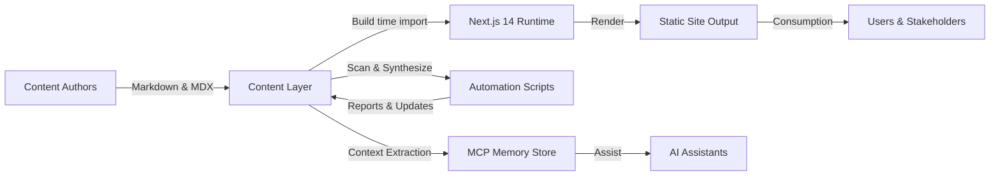
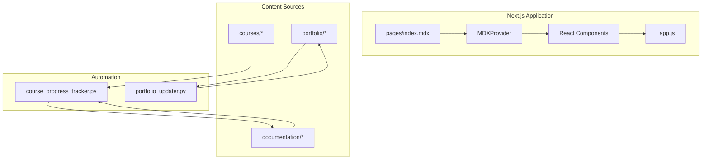
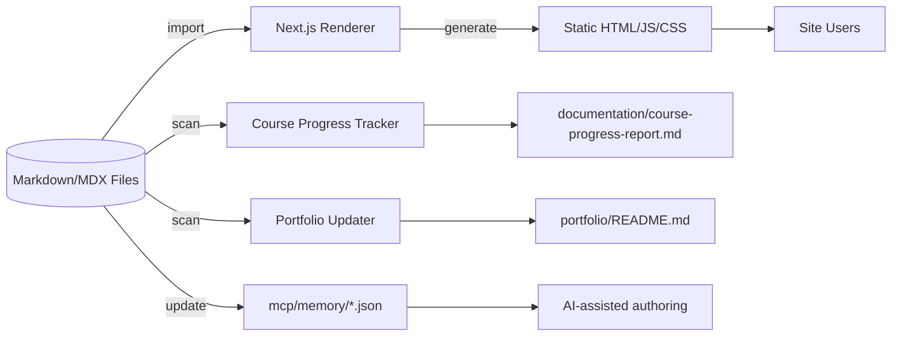

---
{
  "title": "Project Architecture Blueprint",
  "description": "Definitive architectural reference for the TERM-3 SY-2024-25 academic workspace",
  "author": "GitHub Copilot",
  "created": "2025-10-10",
  "updated": "2025-10-10",
  "status": "stable",
  "tags": ["architecture", "blueprint", "nextjs", "mdx", "automation"],
  "detailLevel": "comprehensive"
}
---

# Project Architecture Blueprint

This blueprint documents the architecture of the TERM-3 SY-2024-25 academic workspace. It is intended to govern future changes, preserve architectural integrity, and onboard new contributors rapidly.

## 1. Architecture Detection and Analysis

### Technology Stack Discovery
- **Next.js 14 with MDX**: `package.json`, `next.config.js`, and `pages/_app.js` confirm a React 18 application with MDX integration via `@next/mdx`.
- **React Component Library**: Custom components under `components/` (for example `CourseCard.jsx`, `FeatureHighlight.jsx`) provide reusable UI primitives rendered inside MDX documents.
- **Static Content Layer**: Markdown and MDX files in `pages/`, `courses/`, `documentation/`, and `portfolio/` act as the primary data source. Frontmatter metadata drives AI navigation and automation scripts.
- **Automation Tooling**: Python 3 scripts in `automation/scripts/` (notably `course_progress_tracker.py` and `portfolio_updater.py`) scan the content tree and emit markdown reports.
- **Knowledge Graph Storage**: MCP memory JSON assets in `mcp/memory/` maintain persistent state for AI assistants.

### Architectural Pattern Detection
- **Content-driven Next.js Site**: The project uses the built-in Next.js App Router conventions with MDX pages, indicating a **Static Site with Dynamic Components** pattern.
- **Component Composition**: React function components encapsulate styling via `styled-jsx`, signifying a **Presentational Component** approach.
- **Automation as Sidecar Services**: Python automation scripts operate out-of-band, following a **Batch Processing** pattern that updates documentation artifacts.
- **Separation of Public and Private Materials**: The `learning-materials-private/` directory forms a boundary for sensitive content, aligning with a **Partitioned Repository** strategy.

## 2. Architectural Overview
- The system is a static-first Next.js site enriched with MDX content. React components are injected via the MDX provider to present data-rich, interactive elements while keeping build-time rendering deterministic.
- Guiding principles include strict folder taxonomy, metadata-rich documentation, automation-first workflows, and AI-aware organization.
- Architectural boundaries:
  - **Presentation Layer**: Next.js pages and React components.
  - **Content Layer**: Markdown and MDX files grouped by course and purpose.
  - **Automation Layer**: Python scripts generating derived documentation.
  - **Context Layer**: MCP memory assets storing cross-session knowledge.
- Hybrid patterns: combination of static site generation with runtime-ready React components, and a blend of automated batch updates with manual content authoring.

## 3. Architecture Visualization

### 3.1 High-Level Subsystem Diagram


### 3.2 Component Interaction Diagram


### 3.3 Data Flow Diagram


## 4. Core Architectural Components

### Next.js Presentation Shell (`pages/_app.js`)
- **Purpose**: Provides the global application shell, sets head metadata, and injects the MDX provider.
- **Internal Structure**: Functional React component returning the MDX provider wrapper and global CSS defined via `style jsx global`.
- **Interaction**: Wraps every page, exposes custom components to MDX content. No stateful logic; relies on Next.js lifecycle.
- **Evolution**: Additional global providers (for example theming or analytics) can be added in the same wrapper with minimal impact.

### MDX Content Layer (`pages/index.mdx`, `courses/**`, `documentation/**`)
- **Purpose**: Encodes curriculum, documentation, and portfolio content with metadata.
- **Internal Structure**: Frontmatter metadata followed by MDX content embedding React components and diagrams.
- **Interaction**: Imported at build time by Next.js. Automation scripts treat markdown as semi-structured data.
- **Evolution**: Adding new content is append-only; maintain metadata consistency to keep automation accurate.

### React Component Library (`components/*.jsx`)
- **Purpose**: Encapsulates reusable presentational widgets (course cards, navigation cards, progress meters, etc.).
- **Internal Structure**: Stateless functional components with prop-driven rendering and scoped styling via `styled-jsx`.
- **Interaction**: Registered with the MDX provider; consumed inside MDX documents.
- **Evolution**: Extend components or add new ones in `components/` and remember to export them via `_app.js` for MDX exposure.

### Automation Scripts (`automation/scripts/*.py`)
- **Purpose**: Generate progress reports and synchronize portfolio documentation based on repository state.
- **Internal Structure**: Object-oriented Python modules (`CourseProgressTracker`, `PortfolioUpdater`) with scanning, transformation, and file-writing steps.
- **Interaction**: Operate offline. They read markdown files, compute metrics, and persist derived markdown outputs.
- **Evolution**: Extend scanning heuristics or output formats while preserving idempotent write operations.

### MCP Memory Store (`mcp/memory/*.json`)
- **Purpose**: Track persistent knowledge for AI agents collaborating on the workspace.
- **Internal Structure**: JSON files representing entities, relations, and observations.
- **Interaction**: Not leveraged directly by the Next.js runtime but forms part of the AI-assisted workflow.
- **Evolution**: Managed by MCP tooling; automation scripts should treat it as append-only state.

### Templates (`templates/*.md`)
- **Purpose**: Provide standardized starting points for assignments, notes, projects, and portfolio items.
- **Interaction**: Used by VS Code tasks to ensure consistent structure.
- **Evolution**: Update templates to reflect new metadata requirements or workflow changes.

## 5. Architectural Layers and Dependencies
- **Presentation Layer**: Next.js pages, MDX documents, and React components. Depends only on content files and components registered in `_app.js`.
- **Application Utilities**: Styling via `styled-jsx`, metadata via `Head` in `_app.js`, diagram rendering via MDX (Mermaid).
- **Automation Layer**: Python scripts depend on the file system layout; no reverse dependency ensures separation of concerns.
- **Data Layer**: Markdown/MDX content and MCP JSON assets. No runtime database; persistence is Git-managed files.
- Dependency rules:
  - Components must not import from automation scripts.
  - Automation scripts operate only on disk artifacts and do not import front-end code.
  - MCP memory data is consumed by AI tooling and should remain decoupled from front-end runtime.
- No circular dependencies detected. Dependency injection is implicit via file system structure and MDX provider configuration.

## 6. Data Architecture
- **Domain Model**: Courses, assignments, portfolio items, and documentation are represented as structured directories with markdown metadata.
- **Entity Relationships**: Course directories aggregate assignments, notes, projects, and portfolio items. Portfolio README summarizes items grouped by course. MCP memory entities map resources to academic milestones.
- **Data Access Patterns**: Front-end imports MDX/markdown at build time. Automation scripts traverse directories using `Path.rglob` and `glob` for markdown files.
- **Transformation**: Scripts convert raw file counts and metadata into reports (`documentation/course-progress-report.md`) and summaries (`portfolio/README.md`).
- **Caching**: No explicit caching; Next.js static generation and Git provide versioning.
- **Validation**: Implicit validation occurs through consistent naming conventions and metadata fields. Consider adding schema validation for frontmatter in future iterations.

## 7. Cross-Cutting Concerns Implementation

| Concern | Implementation | Observations |
| --- | --- | --- |
| Authentication & Authorization | Not applicable; site is static and content-driven | Future private deployments may require authentication at hosting level |
| Error Handling & Resilience | Python scripts handle missing directories with safe defaults; front-end relies on Next.js build-time checks | Add logging for automation exceptions to improve traceability |
| Logging & Monitoring | Prints to console during automation runs | Consider integrating structured logging and execution history |
| Validation | File presence and naming conventions act as de facto validation | Add automated checks for required frontmatter fields |
| Configuration Management | Minimal; Next.js config and script constants define behavior | Externalize configurable paths to `.env` files if variability increases |

## 8. Service Communication Patterns
- The system is self-contained. There are no networked services or APIs. Communication occurs through the file system.
- Synchronous operations: Python scripts read and write markdown sequentially.
- No asynchronous messaging or service discovery. Introduce these only if integrating external data sources.

## 9. Technology-Specific Architectural Patterns

### Next.js Architectural Patterns
- Uses the Pages Router with MDX page extensions configured in `next.config.js`.
- Global MDX provider integrates custom components, following the **MDX as Data** pattern.
- Static export is supported (see `trailingSlash` and commented `output: 'export'`), enabling static site hosting.
- Styling is scoped per component using `styled-jsx`, avoiding global CSS collisions.

### React Architectural Patterns
- Functional components with prop interfaces emphasize composition over inheritance.
- Components encapsulate rendering and styling, promoting reuse within MDX content.
- State management is intentionally absent; content is static, ensuring deterministic builds.

### Python Architectural Patterns
- Batch processors follow an **Extract-Transform-Write** pipeline using classes with clear method responsibilities.
- File system interactions rely on `pathlib.Path` for cross-platform compatibility.
- Reporting scripts generate Markdown with formatted sections to maintain documentation consistency.

## 10. Implementation Patterns

### Interface Design Patterns
- Components expose prop-based interfaces (`CourseCard`, `FeatureHighlight`) that act as implicit contracts for MDX authors.
- MDX frontmatter acts as a loose interface for automation scripts; maintaining consistent keys ensures compatibility.

### Service Implementation Patterns
- Automation classes (`CourseProgressTracker`, `PortfolioUpdater`) encapsulate lifecycle methods (`run_tracking`, `run_update`). These act as services invoked manually or via scheduled tasks.
- Lifetime management is short-lived: instantiate, execute, and exit.

### Repository Implementation Patterns
- Python scripts treat the file system as the repository. They employ `Path.glob` to enumerate markdown files and aggregate statistics, functioning like a simple repository layer.

### Controller/API Patterns
- `_app.js` acts as the request controller for page rendering by configuring providers and global styles.
- Next.js automatically maps MDX files to routes, forming the API surface of the static site.

### Domain Model Implementation
- Course directories and markdown files implement the domain model. Portfolio items include headings, descriptions, and metadata consumed by automation scripts.
- `course_progress_tracker.py` enforces business rules (for example weighting categories equally) when calculating completion scores.

## 11. Testing Architecture
- No automated tests are present. Introduce layer-aligned testing strategies:
  - **Unit Tests**: Validate Python script functions (for example file counting, progress calculations) using `pytest`.
  - **Component Tests**: Snapshot test React components with `@testing-library/react`.
  - **Integration Tests**: Run Next.js builds in CI to ensure MDX compilation succeeds.
- Testing data: provide synthetic course directories in fixtures to simulate file system states.

## 12. Deployment Architecture
- Primary deployment target is static hosting (for example Vercel static export or GitHub Pages). `next.config.js` demonstrates readiness for `next export`.
- Environments: local development via `next dev`, production build via `next build` and optional `next export`.
- Runtime dependencies are limited to Node.js for Next.js and Python 3 for automation scripts.
- Configuration per environment can be handled via `process.env` in Next.js if needed; currently unused.

## 13. Extension and Evolution Patterns

### Feature Addition
- Add new React components in `components/` and expose them through the MDX provider.
- Introduce new documentation by copying templates from `templates/` or using predefined VS Code tasks.
- When adding automation capabilities, extend existing Python classes or introduce new scripts under `automation/scripts/`.

### Modification Patterns
- Modify existing components carefully: maintain prop compatibility to avoid breaking MDX content.
- When updating automation heuristics, keep idempotence: regenerate outputs to validate behavior.
- For structural changes, update both documentation and automation scripts to remain in sync.

### Integration Patterns
- To integrate external systems (for example analytics APIs), encapsulate communication in dedicated modules and inject them via `_app.js` providers.
- For content ingestion from external repositories, add scripts that pull data into the `courses/` directory while preserving metadata standards.

## 14. Architectural Pattern Examples

### Layer Separation Example (`pages/_app.js`)
```javascript
const components = {
  CourseCard,
  ProgressMeter,
  FeatureHighlight,
  NavigationCard,
  TechStack,
  Timeline,
};

<MDXProvider components={components}>
  <Component {...pageProps} />
</MDXProvider>
```
This demonstrates how the presentation layer exposes reusable components to MDX content without hard coupling page implementations to specific modules.

### Component Communication Example (`components/CourseCard.jsx`)
```jsx
<CourseCard
  code="MO-IT103"
  name="Computer Programming 2"
  focusAreas={["Advanced Programming", "Web Development", "Database Integration"]}
  status="developing"
  progress={75}
  portfolioItems={3}
  assignments={8}
/>
```
MDX authors pass structured props to presentational components, enabling content-driven rendering.

### Automation Extension Point (`automation/scripts/course_progress_tracker.py`)
```python
course_data[course_code] = {
    "assignments": self.count_files(course_path / "assignments"),
    "projects": self.count_files(course_path / "projects"),
    "notes": self.count_files(course_path / "notes"),
    "portfolio_items": self.count_files(course_path / "portfolio-items"),
}
```
The scanning logic centralizes directory classifications, making it straightforward to add new content buckets by extending this dictionary.

## 15. Architectural Decision Records

| Decision | Context | Consequences |
| --- | --- | --- |
| Adopt Next.js with MDX | Need for static site with interactive components and MDX-rich content | Simplified authoring, static export capability, JavaScript/React skill alignment |
| Use `styled-jsx` in components | Desire for scoped styles without global CSS conflicts | Styles remain co-located with components; developers must understand `styled-jsx` syntax |
| Implement automation in Python | Python proficiency within academic program; need for file system batch operations | Easy text processing, but introduces dual runtime (Node + Python) |
| Maintain strict directory taxonomy | AI-first navigation and automation requirements | Predictable scanning for scripts; changing structure requires updates in multiple places |
| Store AI context in MCP memory JSON | Need persistent AI collaboration context | Enables cross-session awareness; manual edits discouraged to avoid corruption |

## 16. Architecture Governance
- **Documentation Practices**: Frontmatter metadata in markdown files ensures AI and automation compatibility. This blueprint supplements existing guides in `documentation/`.
- **Automated Compliance**: Python scripts indirectly enforce structure by flagging missing directories via zero counts. Consider adding lint scripts to validate metadata.
- **Reviews**: Architectural changes should be peer-reviewed with reference to this blueprint. Introduce change logs in `documentation/` for significant decisions.

## 17. Blueprint for New Development

### Development Workflow
1. Start with a template (`templates/`) or VS Code task to scaffold new content.
2. If new components are required, implement them in `components/` and register in `_app.js`.
3. Update or add MDX/markdown content under the appropriate course or documentation directory.
4. Run automation scripts (`python automation/scripts/course_progress_tracker.py`) to refresh derived reports.
5. Validate via `npm run build` (and `npm run export` when preparing static deployments).

### Implementation Templates
- **React Components**: Functional components with prop destructuring and scoped `style jsx` block.
- **Automation Scripts**: Class-based structure with clearly named methods for scanning, processing, and writing outputs.
- **Documentation Files**: JSON frontmatter followed by structured markdown sections.

### Common Pitfalls
1. Omitting component registration in `_app.js`, preventing MDX access.
2. Altering directory names without updating automation scripts, leading to incorrect metrics.
3. Forgetting to run automation scripts after adding content, resulting in stale portfolio or progress reports.
4. Introducing runtime dependencies (for example external APIs) without assessing static deployment implications.

### Currency and Maintenance
- Generated on 2025-10-10. Review quarterly or after significant architectural changes.
- Update the `updated` field in the frontmatter when modifications occur.
- Maintain alignment with automation scripts whenever directory structures or metadata formats evolve.
