# Quick Start Guide - Academic Workspace

## 🚀 Getting Started

### Daily Workflow
1. **Open VS Code** with the `TERM-3_SY-2024-25.code-workspace` file
2. **Use VS Code Tasks** (Ctrl+Shift+P → "Tasks: Run Task") for quick file creation
3. **Check GitHub Issues** for weekly assignments and tasks
4. **Update Progress** regularly using automation scripts

### Essential VS Code Tasks

| Task | Purpose | Usage |
|------|---------|--------|
| 📝 Create New Assignment | Generate assignment files | Course code + assignment title |
| 📚 Create New Notes | Generate course notes | Course code + topic/module |
| 🚀 Create New Project | Create project directory | Course code + project title |
| 💼 Create Portfolio Item | Generate portfolio content | Course code + item title |
| 📊 Run Progress Tracker | Check course progress | Automated analysis |
| 🔄 Update Portfolio | Sync portfolio changes | Automated updates |
| 📈 Generate Weekly Report | Create progress reports | Weekly documentation |

### Quick File Creation
- **Assignments**: `Ctrl+Shift+P` → "Tasks: Run Task" → "📝 Create New Assignment"
- **Notes**: `Ctrl+Shift+P` → "Tasks: Run Task" → "📚 Create New Notes"
- **Projects**: `Ctrl+Shift+P` → "Tasks: Run Task" → "🚀 Create New Project"

### Markdown Snippets
Type these prefixes in any .md file and press Tab:
- `acadheader` - Academic assignment header
- `noteheader` - Course notes header
- `portfolioheader` - Portfolio item header
- `codeblock` - Documented code block
- `githubissue` - GitHub issue template

## 📁 Directory Structure

```
TERM-3_SY-2024-25/
├── courses/                    # All coursework
│   ├── MO-IT103-Computer-Programming-2/
│   ├── MO-IT143-Ethical-Hacking/
│   ├── MO-IT147-Information-Assurance-Security-1/
│   ├── MO-IT148-Applications-Development-Emerging-Technologies/
│   └── MO-IT151-Platform-Technologies/
│       ├── assignments/        # Weekly assignments
│       ├── projects/          # Major projects
│       ├── notes/             # Course notes
│       └── portfolio-items/   # Portfolio documentation
├── templates/                 # File templates
├── portfolio/                 # Professional portfolio
├── documentation/            # Project documentation
├── automation/              # Scripts and workflows
└── mcp/                    # MCP memory system
```

## 🤖 GitHub Actions (Automated)

### Weekly Task Generator
- **Runs**: Every Monday at 8:00 AM
- **Creates**: Weekly assignment issues for all courses
- **Labels**: Automatically categorizes tasks

### Portfolio Auto-Update
- **Runs**: Every push to main branch
- **Updates**: Portfolio documentation
- **Syncs**: Achievement tracking

### Project Board Management
- **Runs**: On issue updates
- **Manages**: Kanban board automation
- **Tracks**: Progress across courses

## 🧠 MCP Memory Commands

The MCP Memory system maintains a knowledge graph of your entire academic journey. Here's how it works:

```mermaid
flowchart TD
    A[🎓 Student asks question] --> B[🤖 GitHub Copilot]
    B --> C{🧠 MCP Memory Query}
    
    C --> D[📚 Course Entities<br/>5 Subjects]
    C --> E[🚀 Project Entities<br/>Assignments & Projects]
    C --> F[⚙️ System Entities<br/>Automation & Tools]
    C --> G[👤 User Entities<br/>Skills & Progress]
    
    D --> H[📖 Rich Observations<br/>Notes, Assignments, Progress]
    E --> H
    F --> H
    G --> H
    
    H --> I[🔗 Relationship Analysis<br/>Cross-course connections]
    I --> J[📋 Complete Context]
    J --> K[✨ Intelligent Response]
    K --> L[🎯 Actionable Answer]
    
    style A fill:#fff3e0
    style B fill:#e3f2fd
    style C fill:#f3e5f5
    style L fill:#e8f5e8
```



### Automatic Knowledge Retrieval
When you ask Copilot questions like:
- **"What courses am I taking?"** → Retrieves all course entities and enrollment relationships
- **"Show my project progress"** → Analyzes project entities and completion observations
- **"What skills am I developing?"** → Maps skills across courses and portfolio items
- **"Find related coursework"** → Uses relationship graph to connect topics across subjects

### Manual Memory Commands
For advanced users who want direct memory interaction:
```
@copilot /memory add "Completed advanced SQL project in MO-IT103"
@copilot /memory search "ethical hacking projects"
@copilot /memory show-entities "courses"
```

## 💡 Pro Tips

### File Naming Convention
- **Assignments**: `assignment-YYYY-MM-DD-topic-name.md`
- **Notes**: `notes-YYYY-MM-DD-topic-name.md`
- **Projects**: Use descriptive folder names
- **Portfolio**: `portfolio-YYYY-MM-DD-item-name.md`

### Git Workflow
1. Create feature branch for each assignment/project
2. Commit regularly with descriptive messages
3. Use pull requests for major project milestones
4. Tag releases for portfolio submissions

### Portfolio Development
- Document **every** significant project
- Include **code samples** and explanations
- Capture **learning outcomes** for each course
- Collect **testimonials** from instructors
- Update **skills matrix** regularly

### Privacy Management
- Keep sensitive academic materials in private repository
- Use public repository for portfolio and collaboration
- Follow school regulations for content sharing
- Maintain professional presentation standards

## 🔧 Troubleshooting

### Common Issues
- **Task not found**: Check `.vscode/tasks.json` exists
- **Template not copying**: Verify template files exist in `templates/`
- **GitHub Actions failing**: Check repository settings and secrets
- **MCP memory issues**: Use backup/restore tasks

### Reset/Restore
- **Backup MCP Memory**: Use VS Code task "🧠 Backup MCP Memory"
- **Reset Templates**: Copy from `templates/` to destination
- **Restore Workflows**: Check `.github/workflows/` directory

## 📞 Need Help?

1. **Check Documentation**: Review files in `documentation/`
2. **Use MCP Memory**: Ask Copilot about previous work
3. **Review Templates**: All templates include detailed instructions
4. **Check GitHub Issues**: Look for similar problems/solutions

---

**Remember**: This workspace grows with you. Add new templates, modify workflows, and enhance automation as you develop your skills throughout TERM-3 SY-2024-25!
