# Independent Subject Workspaces Guide

## 🎯 Problem Solved
You wanted **separate VS Code windows for each subject** where:
- Each subject has its own independent chatbox/Copilot context
- Files from other subjects are hidden and cannot be accidentally accessed
- Each workspace is locked to its specific course directory

## 🚀 How to Use

### Method 1: Double-Click Workspace Files
Navigate to your main folder and double-click any of these files:
- `MO-IT103-Computer-Programming-2.code-workspace` 
- `MO-IT143-Ethical-Hacking.code-workspace`
- `MO-IT147-Information-Assurance-Security-1.code-workspace`
- `MO-IT148-Applications-Development-Emerging-Technologies.code-workspace`
- `MO-IT151-Platform-Technologies.code-workspace`

### Method 2: Use the Launcher (Recommended)
1. Double-click `launch-subject.bat`
2. Choose the subject number (1-5)
3. VS Code opens with **ONLY** that subject's files visible

### Method 3: Command Line
```bash
# Open specific subject
code "MO-IT103-Computer-Programming-2.code-workspace"
code "MO-IT143-Ethical-Hacking.code-workspace"
# etc.

# Open all subjects at once (5 separate windows)
code "MO-IT103-Computer-Programming-2.code-workspace"
code "MO-IT143-Ethical-Hacking.code-workspace"
code "MO-IT147-Information-Assurance-Security-1.code-workspace"
code "MO-IT148-Applications-Development-Emerging-Technologies.code-workspace"
code "MO-IT151-Platform-Technologies.code-workspace"
```

## 🔒 What Each Subject Workspace Includes

### Visible Folders
- **📚 [Subject Name]** - Only this subject's files (assignments, projects, notes, portfolio-items)
- **📁 Templates** - Shared templates for file creation
- **💼 Portfolio Items** - This subject's portfolio items only

### Hidden/Excluded
- ❌ All other subject folders are **completely hidden**
- ❌ Cannot search or access files from other subjects
- ❌ File explorer shows **only** the current subject

## 🤖 Independent Copilot Context

Each workspace has its own:
- **Separate chat history** - Conversations don't mix between subjects
- **Subject-specific context** - Copilot knows only about the current subject
- **Isolated file access** - Cannot accidentally reference other subjects' files
- **Focused assistance** - AI help is specific to the current course

## 📁 Directory Isolation

When you open `MO-IT103-Computer-Programming-2.code-workspace`:
```
✅ Visible:
├── 📚 MO-IT103 - Computer Programming 2/
│   ├── assignments/
│   ├── projects/
│   ├── notes/
│   └── portfolio-items/
├── 📁 Templates/
└── 💼 Portfolio Items/ (MO-IT103 only)

❌ Hidden:
├── MO-IT143-Ethical-Hacking/          (EXCLUDED)
├── MO-IT147-Information-Assurance/    (EXCLUDED)  
├── MO-IT148-Applications-Development/ (EXCLUDED)
└── MO-IT151-Platform-Technologies/    (EXCLUDED)
```

## 💡 Benefits

1. **No Cross-Contamination** - Cannot accidentally edit wrong subject's files
2. **Focused Work Environment** - Only see files relevant to current subject
3. **Separate AI Contexts** - Each subject has independent Copilot conversations
4. **Better Organization** - Cleaner file explorer with less clutter
5. **Subject-Specific Settings** - Each workspace can have different themes/settings

## 🔧 Workflow Example

**Studying Computer Programming (MO-IT103):**
1. Double-click `MO-IT103-Computer-Programming-2.code-workspace`
2. VS Code opens showing **only** MO-IT103 files
3. Chat with Copilot about programming concepts
4. Create assignments using templates
5. All work stays in MO-IT103 context

**Switch to Ethical Hacking (MO-IT143):**
1. Double-click `MO-IT143-Ethical-Hacking.code-workspace` 
2. **New VS Code window** opens with **only** MO-IT143 files
3. **Fresh Copilot chat** specific to ethical hacking
4. Cannot see or access programming files
5. Completely separate work environment

## 🎯 Perfect Solution For Your Needs

✅ **Separate chatbox per subject** - Each workspace = independent Copilot context  
✅ **Cannot change file directory** - Other subjects are completely hidden  
✅ **Independent windows** - Each subject opens in its own VS Code instance  
✅ **No file mixing** - Impossible to accidentally work on wrong subject  
✅ **Clean workspace** - Only see files relevant to current subject  

Your original problem is now **completely solved**! 🎉

## 🧠 MCP Memory Integration with Independent Workspaces

The MCP Memory system maintains context awareness even when working in independent subject workspaces:

```mermaid
graph TD
    subgraph "Shared MCP Memory"
        M[🧠 Central Knowledge Graph<br/>All 5 Courses + Relationships]
    end
    
    subgraph "Independent VS Code Windows"
        W1[💻 MO-IT103 Window<br/>Programming Focus]
        W2[🔒 MO-IT143 Window<br/>Security Focus]
        W3[🛡️ MO-IT147 Window<br/>Assurance Focus]
        W4[🚀 MO-IT148 Window<br/>Emerging Tech Focus]
        W5[⚙️ MO-IT151 Window<br/>Platform Focus]
    end
    
    subgraph "AI Context Benefits"
        C1[🎯 Subject-Focused Chat]
        C2[🔗 Cross-Course Connections]
        C3[📊 Progress Awareness]
        C4[💡 Smart Suggestions]
    end
    
    %% Memory connection to each workspace
    M --> W1
    M --> W2
    M --> W3
    M --> W4
    M --> W5
    
    %% Benefits from each workspace
    W1 --> C1
    W2 --> C1
    W3 --> C1
    W4 --> C1
    W5 --> C1
    
    M --> C2
    M --> C3
    M --> C4
    
    %% Styling
    style M fill:#f3e5f5,stroke:#4a148c,stroke-width:3px
    style C1 fill:#e8f5e8,stroke:#1b5e20
    style C2 fill:#e1f5fe,stroke:#01579b
```



### How It Works

1. **Shared Knowledge**: All workspaces access the same MCP Memory knowledge graph
2. **Focused Context**: Each window only shows files for that subject  
3. **Intelligent Connections**: Copilot can still reference related work from other courses
4. **Progressive Learning**: As you work in each subject, the shared memory gets smarter

### Example Interactions

**In MO-IT103 Window:**
- *You*: "Help with database security"  
- *Copilot*: "Based on your MO-IT143 security knowledge and MO-IT147 policy work..."

**In MO-IT143 Window:**
- *You*: "Test this web application"
- *Copilot*: "I see you built this in MO-IT103. Let me suggest security tests..."

**In MO-IT148 Window:**
- *You*: "Deploy to cloud platform"
- *Copilot*: "Connecting to your MO-IT151 platform knowledge for best practices..."
