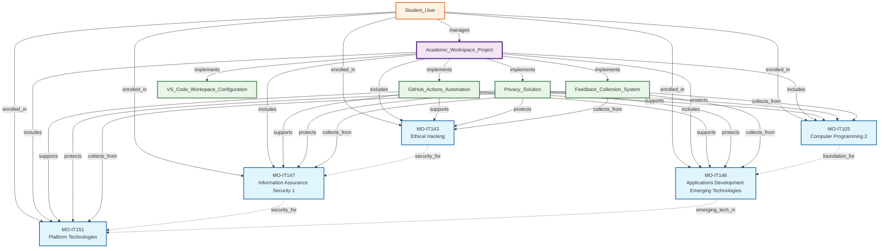
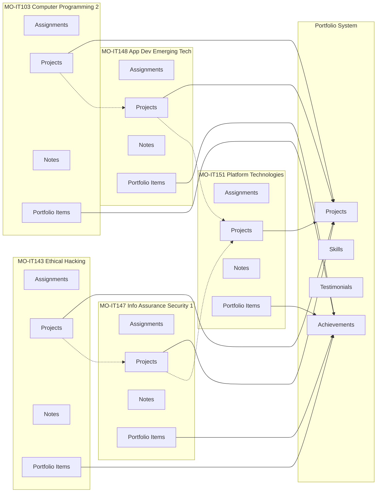
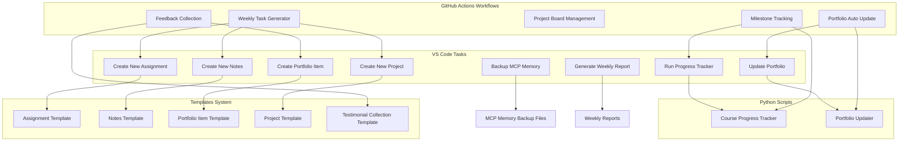
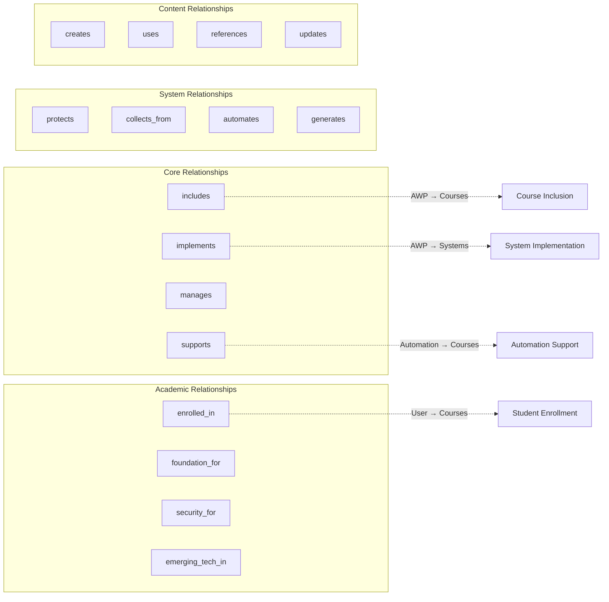
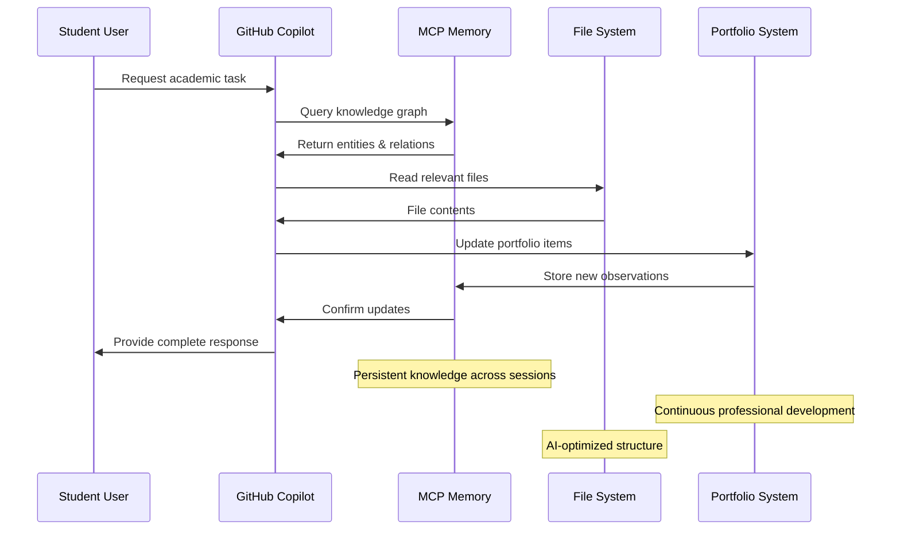

# MCP Memory Knowledge Graph Visualization

## Overview

This document provides comprehensive Mermaid diagrams visualizing the MCP Memory Knowledge Graph structure for the TERM-3 SY-2024-25 Academic Workspace.

## Core Academic Workspace Architecture

## Course Ecosystem Detailed View

## Automation Workflow Network

## MCP Memory Entity Types Structure

```mermaid
graph TD
    subgraph "Entity Types"
        PROJECT[Project Entities]
        COURSE[Course Entities]
        SYSTEM[System Entities]
        USER[User Entities]
        CONTENT[Content Entities]
    end
    
    subgraph "Project Entities"
        AWP[Academic_Workspace_Project]
    end
    
    subgraph "Course Entities"
        IT103[MO-IT103]
        IT143[MO-IT143]
        IT147[MO-IT147]
        IT148[MO-IT148]
        IT151[MO-IT151]
    end
    
    subgraph "System Entities"
        GHA[GitHub_Actions_Automation]
        PS[Privacy_Solution]
        FCS[Feedback_Collection_System]
        VS[VS_Code_Workspace_Configuration]
    end
    
    subgraph "User Entities"
        SU[Student_User]
    end
    
    subgraph "Content Entities"
        TEMPLATES[Template_System]
        PORTFOLIO[Portfolio_System]
        AUTOMATION[Automation_Scripts]
    end
    
    %% Type Classifications
    PROJECT --> AWP
    COURSE --> IT103
    COURSE --> IT143
    COURSE --> IT147
    COURSE --> IT148
    COURSE --> IT151
    SYSTEM --> GHA
    SYSTEM --> PS
    SYSTEM --> FCS
    SYSTEM --> VS
    USER --> SU
    CONTENT --> TEMPLATES
    CONTENT --> PORTFOLIO
    CONTENT --> AUTOMATION
```

## Relationship Types Hierarchy

## MCP Memory Data Flow

## Usage Instructions

### Viewing Knowledge Graph

1. Use MCP Memory tools to explore entities and relationships
2. Reference this visualization for understanding connections
3. Cross-reference with actual JSON files for detailed observations

### Maintaining the Graph

1. Regular updates through MCP Memory tools
2. Document new relationships as courses progress
3. Backup memory files regularly using VS Code tasks

### Integration Points

- GitHub Actions workflows reference these relationships
- Portfolio system updates based on course progress
- VS Code tasks utilize entity structure for organization
- Template system aligned with entity types

## Files Integration

- This visualization complements `mcp-memory-usage-instructions.md`
- Used by automation scripts for context-aware processing
- Referenced in course README files for relationship understanding
- Supports independent workspace configurations
