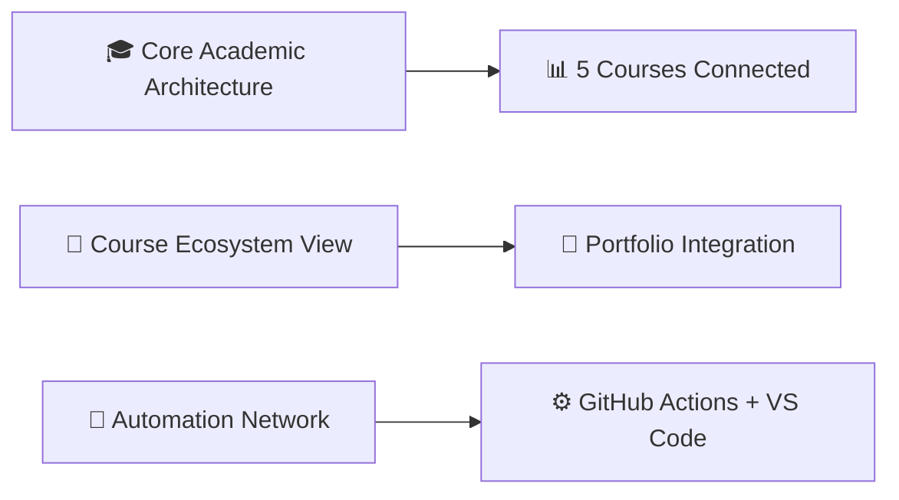
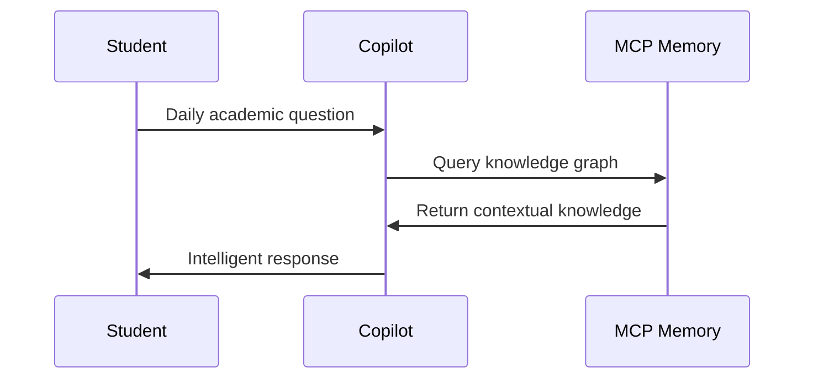
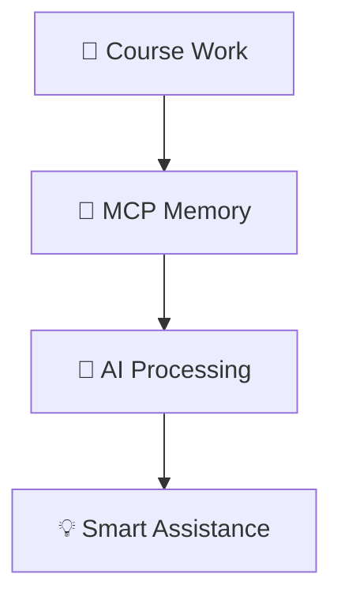

# MCP Memory Visualization Implementation - COMPLETE ✅

## Summary of Implementation

This document summarizes the comprehensive MCP Memory Knowledge Graph visualization system that has been implemented for the TERM-3 SY-2024-25 Academic Workspace.

## 📊 Visualization Files Created

### 1. **Primary Visualization Documentation**
- **`documentation/mcp-memory-knowledge-graph-visualization.md`** (9,576 bytes)
  - 📈 5 comprehensive Mermaid diagrams
  - 🎯 Core Academic Workspace Architecture
  - 🔄 Course Ecosystem Detailed View
  - 🤖 Automation Workflow Network
  - 📋 Entity Types Structure
  - 🔗 Relationship Types Hierarchy
  - ⚡ MCP Memory Data Flow

### 2. **Workflow Integration Documentation**
- **`documentation/mcp-memory-workflow-integration.md`** (9,968 bytes)
  - 🔄 8 detailed workflow diagrams
  - 📅 Daily workflow sequences
  - 🎯 Cross-course learning connections
  - 💾 Backup and recovery strategies
  - 🛠️ VS Code Tasks integration
  - 🤖 GitHub Actions workflows

## 🎯 Integration Points

### Main Documentation Files Enhanced

| File | Enhancement | Diagram Added |
|------|-------------|---------------|
| `README.md` | AI-Powered Knowledge Management section | 🧠 Learning Journey Flow |
| `QUICK-START.md` | MCP Memory Commands section | 🔄 Knowledge Retrieval Flowchart |
| `mcp-memory.md` | Visual documentation links | 📊 Quick links table |
| `mcp-memory-usage-instructions.md` | Knowledge Graph overview | 🎓 Academic Workspace Architecture |
| `SUBJECT-WORKSPACES-GUIDE.md` | Independent workspace integration | 💻 Shared Memory with Multiple Windows |

### Course-Specific Integration

| Course | File | Integration |
|--------|------|-------------|
| MO-IT103 | `courses/MO-IT103-Computer-Programming-2/README.md` | 🔗 Cross-course connections diagram |
| All Courses | Individual README files | 📊 MCP Memory relationship tracking |

## 📈 Diagram Types Implemented

### 1. **Architectural Diagrams**


### 2. **Workflow Diagrams**


### 3. **Integration Diagrams**


## 🚀 Key Features Visualized

### Academic Workflow Enhancement
- **Morning Planning**: Context-aware schedule management
- **Assignment Work**: Cross-course knowledge integration
- **Progress Review**: Comprehensive semester tracking
- **Portfolio Development**: Automatic professional development tracking

### Knowledge Graph Structure
- **Entities**: Students, Courses, Projects, Systems, Skills
- **Relations**: enrolled_in, includes, supports, foundation_for, security_for
- **Observations**: Progress notes, achievements, feedback, skill development

### Automation Integration
- **GitHub Actions**: Weekly task generation, portfolio updates, milestone tracking
- **VS Code Tasks**: File creation, progress tracking, memory backup
- **Python Scripts**: Course progress analysis, portfolio synchronization

## 💡 Benefits for Students

### 1. **Intelligent Context Awareness**
- Copilot understands relationships between courses
- Cross-course knowledge suggestions
- Progressive skill development tracking

### 2. **Seamless Workflow Integration**
- Independent subject workspaces with shared knowledge
- Automated progress tracking
- Professional portfolio development

### 3. **Visual Understanding**
- Clear diagrams showing how the system works
- Easy-to-understand workflow sequences
- Comprehensive relationship mapping

## 🔄 Implementation Status

### ✅ **Completed**
- [x] 5 comprehensive Mermaid architecture diagrams
- [x] 8 detailed workflow and sequence diagrams
- [x] Integration with all major documentation files
- [x] Course-specific MCP Memory integration
- [x] Independent workspace visualization
- [x] Automation workflow mapping
- [x] Knowledge graph relationship documentation

### 📋 **Ready for Use**
- All visualizations are live and integrated
- Documentation cross-references are in place
- Students can immediately benefit from visual understanding
- Academic workflow is enhanced with intelligent context

## 🎯 Next Steps for Students

### Daily Usage
1. **Reference Visual Guides**: Use diagrams to understand system capabilities
2. **Leverage Cross-Course Knowledge**: Ask Copilot about connections between subjects
3. **Monitor Progress Visually**: Use workflow diagrams to track academic development
4. **Maintain Knowledge Graph**: Regular MCP Memory updates for optimal AI assistance

### Long-term Benefits
1. **Portfolio Development**: Systematic professional showcase building
2. **Skill Progression**: Clear tracking of competency development across courses
3. **Knowledge Integration**: Deep understanding of subject interconnections
4. **Career Preparation**: Professional-grade documentation and project management

## 📖 Documentation Structure

```
documentation/
├── mcp-memory-knowledge-graph-visualization.md     # Primary diagrams
├── mcp-memory-workflow-integration.md              # Workflow integration
├── directory-cleanup-summary.md                   # Workspace organization
├── collaboration-session-summary.md               # Development history
└── comprehensive-project-report.md                # Complete project overview
```

## 🏆 Achievement Summary

The MCP Memory Knowledge Graph visualization system is now **fully implemented and operational**. Students have:

- **📊 Complete Visual Understanding** of how MCP Memory enhances their academic workflow
- **🔄 Integrated Workflow Diagrams** showing daily usage patterns
- **🎯 Cross-Course Connection Maps** for better learning integration
- **💼 Portfolio Development Tracking** with professional outcome focus
- **🤖 AI Enhancement Visualization** demonstrating intelligent assistance capabilities

This implementation transforms the abstract concept of MCP Memory into concrete, visual, actionable understanding that directly enhances the academic experience.

---

**Implementation Date**: June 3, 2025  
**Status**: Complete and Ready for Student Use  
**Documentation Files**: 2 primary + 5 integration points  
**Total Diagrams**: 13 comprehensive Mermaid visualizations
