# MCP Memory Workflow Integration

## Overview

This document demonstrates how MCP Memory enhances the TERM-3 SY-2024-25 Academic Workspace through intelligent knowledge graph management and AI-powered assistance.

## Complete MCP Memory Ecosystem

```mermaid
graph TB
    subgraph "Data Sources"
        A[📝 Course Assignments]
        B[🚀 Project Files]
        C[📚 Study Notes]
        D[💼 Portfolio Items]
        E[⚙️ System Configurations]
    end
    
    subgraph "MCP Memory Knowledge Graph"
        F[🧠 Entities JSON<br/>- Students<br/>- Courses<br/>- Projects<br/>- Systems]
        G[🔗 Relations JSON<br/>- enrolled_in<br/>- includes<br/>- supports<br/>- foundation_for]
        H[📊 Observations JSON<br/>- Progress notes<br/>- Skills developed<br/>- Achievements<br/>- Feedback]
    end
    
    subgraph "AI Processing Layer"
        I[🤖 GitHub Copilot]
        J[🔍 Context Retrieval]
        K[🎯 Smart Suggestions]
        L[📈 Progress Analysis]
    end
    
    subgraph "Output & Actions"
        M[💡 Intelligent Responses]
        N[📋 Progress Reports]
        O[🎯 Learning Insights]
        P[💼 Portfolio Updates]
    end
    
    %% Data flow
    A --> F
    B --> F
    C --> F
    D --> F
    E --> F
    
    A --> G
    B --> G
    C --> G
    D --> G
    
    A --> H
    B --> H
    C --> H
    D --> H
    
    %% AI processing
    F --> I
    G --> I
    H --> I
    
    I --> J
    I --> K
    I --> L
    
    %% Output generation
    J --> M
    K --> M
    L --> N
    L --> O
    M --> P
    
    %% Styling
    classDef dataNode fill:#e1f5fe,stroke:#01579b,stroke-width:2px
    classDef memoryNode fill:#f3e5f5,stroke:#4a148c,stroke-width:3px
    classDef aiNode fill:#e8f5e8,stroke:#1b5e20,stroke-width:2px
    classDef outputNode fill:#fff3e0,stroke:#e65100,stroke-width:2px
    
    class A,B,C,D,E dataNode
    class F,G,H memoryNode
    class I,J,K,L aiNode
    class M,N,O,P outputNode
```

## Daily Workflow with MCP Memory

### 1. Morning Planning

### 2. Working on Assignments

### 3. Progress Review

## Knowledge Graph Relationships

### Core Entity Types

## Automated MCP Memory Updates

### VS Code Tasks Integration

```mermaid
flowchart LR
    subgraph "VS Code Tasks"
        A[📝 Create Assignment] --> B[🧠 Update MCP Memory]
        C[🚀 Create Project] --> B
        D[💼 Create Portfolio Item] --> B
        E[📊 Run Progress Tracker] --> B
    end
    
    subgraph "MCP Memory Updates"
        B --> F[➕ Add Entity]
        B --> G[🔗 Create Relations]
        B --> H[📊 Add Observations]
    end
    
    subgraph "GitHub Actions"
        I[⏰ Weekly Task Generator] --> J[📝 Create Issues]
        K[📈 Portfolio Auto-Update] --> L[💼 Sync Portfolio]
        M[🎯 Milestone Tracking] --> N[📊 Update Progress]
    end
    
    subgraph "Memory Synchronization"
        J --> B
        L --> B
        N --> B
    end
```

## Cross-Course Learning Connections

### Example: Security Integration

```mermaid
graph TB
    subgraph "Programming Foundation (MO-IT103)"
        A[💻 Secure Coding Practices]
        B[🗄️ Database Security]
        C[🌐 Web Application Security]
    end
    
    subgraph "Ethical Hacking (MO-IT143)"
        D[🔍 Vulnerability Assessment]
        E[🔒 Penetration Testing]
        F[⚠️ Security Audit Reports]
    end
    
    subgraph "Information Assurance (MO-IT147)"
        G[📋 Security Policies]
        H[🛡️ Risk Assessment]
        I[📊 Compliance Frameworks]
    end
    
    subgraph "Platform Technologies (MO-IT151)"
        J[☁️ Cloud Security]
        K[🔧 DevSecOps]
        L[🛡️ Infrastructure Protection]
    end
    
    %% Cross-course connections tracked by MCP Memory
    A --> D
    B --> D
    C --> E
    D --> G
    E --> H
    F --> I
    G --> J
    H --> K
    I --> L
    
    %% MCP Memory relationship tracking
    M[🧠 MCP Memory<br/>Relationship Tracking] -.-> A
    M -.-> D
    M -.-> G
    M -.-> J
    
    style M fill:#f3e5f5,stroke:#4a148c,stroke-width:3px
```

## Memory Backup and Recovery

### Backup Strategy

```mermaid
flowchart TD
    A[📅 Daily Work] --> B[🧠 MCP Memory Updates]
    B --> C{📊 Weekly Backup Check}
    
    C -->|Automated| D[🤖 GitHub Actions Backup]
    C -->|Manual| E[💻 VS Code Task Backup]
    
    D --> F[📁 Repository Backup]
    E --> F
    
    F --> G[📂 mcp/memory/backups/YYYY-MM-DD-HHMM/]
    G --> H[💾 entities.json]
    G --> I[💾 relations.json]
    G --> J[💾 observations.json]
    
    K[⚠️ System Reset Needed] --> L[🔄 Restore from Backup]
    L --> M[📋 Choose Backup Date]
    M --> N[♻️ Restore Memory Files]
    N --> O[✅ Verify Knowledge Graph]
```

## Best Practices

### 1. Regular Memory Maintenance

- **Weekly**: Review and clean outdated observations
- **Monthly**: Backup memory files to external storage
- **Semester End**: Archive complete knowledge graph

### 2. Quality Observations

- Use specific, actionable language
- Include measurable outcomes when possible
- Connect to portfolio development goals
- Reference specific technologies and skills

### 3. Relationship Modeling

- Map dependencies between courses accurately
- Track skill progression across subjects
- Document cross-course project connections
- Maintain portfolio integration pathways

### 4. Privacy and Security

- Keep sensitive academic content in private repositories
- Use generic descriptions for confidential projects
- Backup memory files securely
- Follow institutional data policies

## Troubleshooting

### Common Issues

1. **Memory Not Loading**: Check MCP server connection
2. **Missing Relationships**: Verify JSON file integrity
3. **Outdated Context**: Run memory backup and restore
4. **Slow Responses**: Consider memory file optimization

### Recovery Procedures

1. **Backup Current State**: Always backup before changes
2. **Identify Issue**: Check specific JSON files
3. **Restore from Backup**: Use most recent working backup
4. **Rebuild if Necessary**: Start fresh with core entities

## Integration with Academic Tools

### GitHub Actions Workflows

- **Weekly Task Generator**: Creates memory entities for new assignments
- **Portfolio Auto-Update**: Maintains portfolio-course relationships
- **Milestone Tracking**: Updates progress observations
- **Feedback Collection**: Captures learning outcomes

### VS Code Tasks

- **File Creation**: Automatically adds entities for new work
- **Progress Tracking**: Updates completion observations
- **Portfolio Updates**: Maintains professional development tracking
- **Memory Backup**: Preserves knowledge graph state

This comprehensive MCP Memory integration ensures that your academic workspace becomes increasingly intelligent and helpful as you progress through your studies, creating a powerful foundation for both learning and professional development.
