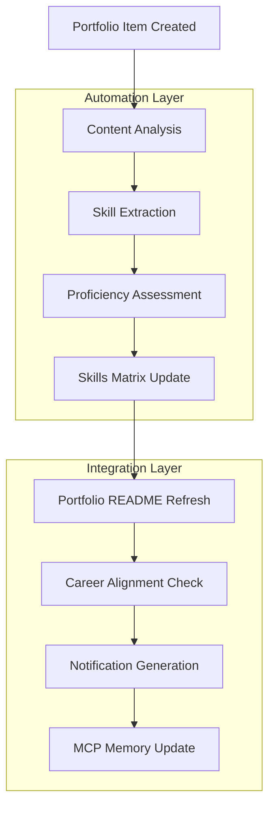

# 🎯 Portfolio System: Comprehensive Design & Architecture Documentation

**Document Version**: 1.0
**Created**: June 3, 2025
**Author**: Academic Workspace Ecosystem
**Purpose**: Complete technical specification for the BS IT Network & Cybersecurity Portfolio System

---

## 📋 Table of Contents

1. [Executive Summary](#executive-summary)
2. [System Architecture](#system-architecture)
3. [Database Design](#database-design)
4. [Conceptual Models](#conceptual-models)
5. [Use Case Documentation](#use-case-documentation)
6. [Portfolio Logic Framework](#portfolio-logic-framework)
7. [Automation Workflows](#automation-workflows)
8. [Integration Specifications](#integration-specifications)
9. [Security &amp; Privacy](#security-privacy)
10. [Performance &amp; Scalability](#performance-scalability)
11. [Implementation Roadmap](#implementation-roadmap)

---

## 1. Executive Summary

### 🎯 System Overview

The Portfolio System transforms academic coursework into a professional career development platform for BS IT Network & Cybersecurity students. It provides automated portfolio generation, skills tracking, and industry-ready presentation of academic achievements.

### 📊 Key Metrics & Goalse:

### 🏆 Business Value

- **Academic Excellence**: Transform coursework into career assets
- **Professional Readiness**: Industry-standard portfolio presentation
- **Career Acceleration**: Automated skill development tracking
- **Competitive Advantage**: Comprehensive technical competency demonstration

---

## 2. System Architecture

### 🏗️ High-Level Architecture Diagram

```
┌─────────────────────────────────────────────────────────────────┐
│                    PORTFOLIO ECOSYSTEM                          │
├─────────────────────────────────────────────────────────────────┤
│  ┌─────────────┐    ┌─────────────┐    ┌─────────────┐        │
│  │   COURSE    │    │  PORTFOLIO  │    │   CAREER    │        │
│  │  CONTENT    │───▶│   ENGINE    │───▶│ DEVELOPMENT │        │
│  │   LAYER     │    │    LAYER    │    │    LAYER    │        │
│  └─────────────┘    └─────────────┘    └─────────────┘        │
│         │                   │                   │             │
│  ┌─────────────┐    ┌─────────────┐    ┌─────────────┐        │
│  │ AUTOMATION  │    │   SKILLS    │    │ PROFESSIONAL│        │
│  │   LAYER     │    │  TRACKING   │    │PRESENTATION │        │
│  └─────────────┘    └─────────────┘    └─────────────┘        │
└─────────────────────────────────────────────────────────────────┘
                              │
                    ┌─────────────────┐
                    │   INTEGRATION   │
                    │     LAYER       │
                    │                 │
                    │ • GitHub Actions│
                    │ • VS Code Tasks │
                    │ • MCP Memory    │
                    │ • File System   │
                    └─────────────────┘
```

### 🔧 Component Architecture

#### 2.1 Core Components

| Component                   | Purpose                       | Technology         | Status    |
| --------------------------- | ----------------------------- | ------------------ | --------- |
| **Portfolio Engine**  | Content scanning & processing | Python             | ✅ Active |
| **Skills Matrix**     | Dynamic competency tracking   | Markdown + JSON    | ✅ Active |
| **Automation Hub**    | Workflow orchestration        | GitHub Actions     | ✅ Active |
| **Content Templates** | Standardized formatting       | Markdown Templates | ✅ Active |
| **Progress Tracker**  | Analytics & reporting         | Python + JSON      | ✅ Active |

#### 2.2 System Integration Flow

```
Academic Content → Portfolio Engine → Skills Analysis → Professional Output
       │                    │              │                    │
   ┌───────┐         ┌─────────────┐  ┌─────────────┐    ┌─────────────┐
   │Course │         │Content      │  │Skills       │    │Professional │
   │Files  │ ──────▶ │Extraction   │─▶│Mapping      │───▶│Portfolio    │
   │       │         │& Metadata   │  │& Tracking   │    │Generation   │
   └───────┘         └─────────────┘  └─────────────┘    └─────────────┘
       │                    │              │                    │
   Templates          Automation      Analytics         Career Assets
```

---

## 3. Database Design

### 📊 Data Architecture

#### 3.1 Logical Data Model

```
PORTFOLIO SYSTEM DATA MODEL
═══════════════════════════

┌─────────────────┐     ┌─────────────────┐     ┌─────────────────┐
│     COURSES     │     │  PORTFOLIO_ITEMS│     │     SKILLS      │
├─────────────────┤     ├─────────────────┤     ├─────────────────┤
│ course_id (PK)  │────▶│ item_id (PK)    │◄────│ skill_id (PK)   │
│ course_code     │     │ course_id (FK)  │     │ skill_name      │
│ course_name     │     │ title           │     │ category        │
│ description     │     │ description     │     │ proficiency     │
│ credits         │     │ completion_date │     │ evidence_items  │
│ status          │     │ skills_demo     │     │ last_updated    │
└─────────────────┘     │ file_path       │     └─────────────────┘
                        │ metadata        │             │
                        └─────────────────┘             │
                                │                       │
                        ┌─────────────────┐     ┌─────────────────┐
                        │  ACHIEVEMENTS   │     │   TESTIMONIALS  │
                        ├─────────────────┤     ├─────────────────┤
                        │ achievement_id  │     │ testimonial_id  │
                        │ item_id (FK)    │     │ author_name     │
                        │ type            │     │ relationship    │
                        │ description     │     │ content         │
                        │ date_earned     │     │ date_received   │
                        │ verification    │     │ item_id (FK)    │
                        └─────────────────┘     └─────────────────┘
```

#### 3.2 File System Database Schema

```json
{
  "portfolio_metadata": {
    "version": "1.0",
    "last_updated": "2025-06-03T18:17:38.545272",
    "total_items": 3,
    "completion_percentage": 20.0,
    "courses": {
      "MO-IT103": {
        "course_name": "Computer Programming 2",
        "portfolio_items": 1,
        "skills_demonstrated": ["Programming", "Database Integration"],
        "last_activity": "2025-06-03T16:01:31.411492"
      },
      "MO-IT143": {
        "course_name": "Ethical Hacking",
        "portfolio_items": 1,
        "skills_demonstrated": ["Penetration Testing", "Security Assessment"],
        "last_activity": "2025-06-03T16:01:31.517775"
      }
    }
  }
}
```

### 📁 Data Storage Architecture

```
Portfolio Data Storage Hierarchy
├── portfolio/
│   ├── README.md                 # Main portfolio presentation
│   ├── metadata.json            # System metadata
│   ├── achievements/
│   │   ├── academic/            # Course-based achievements
│   │   ├── certifications/      # Professional certifications
│   │   └── projects/           # Project-based achievements
│   ├── projects/
│   │   ├── cross-course/       # Multi-discipline projects
│   │   ├── individual/         # Single-course projects
│   │   └── collaborative/      # Team projects
│   ├── skills/
│   │   ├── README.md           # Skills matrix
│   │   ├── technical/          # Technical competencies
│   │   ├── soft-skills/        # Professional skills
│   │   └── certifications/     # Skill verifications
│   └── testimonials/
│       ├── instructors/        # Faculty feedback
│       ├── peers/             # Student feedback
│       └── industry/          # Professional references
```

---

## 4. Conceptual Models

### 🧠 Portfolio Development Lifecycle

```
PORTFOLIO ITEM LIFECYCLE MODEL
════════════════════════════

┌─────────────┐    ┌─────────────┐    ┌─────────────┐    ┌─────────────┐
│   CREATED   │───▶│ IN PROGRESS │───▶│  COMPLETED  │───▶│  PUBLISHED  │
└─────────────┘    └─────────────┘    └─────────────┘    └─────────────┘
       │                   │                   │                   │
   • Template         • Content           • Quality         • Portfolio
     Applied            Development         Review            Integration
   • Metadata         • Skill             • Metadata        • Skills
     Initialized        Tracking            Update            Matrix Update
   • Course           • Progress          • Achievement     • Professional
     Assignment         Monitoring          Recognition       Presentation
```

### 🎯 Skills Development Framework

```
COMPETENCY DEVELOPMENT MODEL
══════════════════════════

Level 0: FOUNDATION        Level 1: DEVELOPING       Level 2: PROFICIENT
├─ Basic Concepts         ├─ Applied Knowledge      ├─ Independent Work
├─ Guided Practice        ├─ Problem Solving        ├─ Complex Projects
└─ Simple Tasks          └─ Tool Usage            └─ Best Practices

         │                        │                        │
         ▼                        ▼                        ▼

Level 3: ADVANCED          Level 4: EXPERT           Level 5: LEADERSHIP
├─ Innovation             ├─ Thought Leadership     ├─ Industry Recognition
├─ Mentoring Others       ├─ Standard Setting       ├─ Strategic Influence
└─ Complex Solutions      └─ Knowledge Creation     └─ Ecosystem Building

Portfolio Evidence Required:
• Code Samples            • Security Assessments    • System Designs
• Project Documentation   • Problem Resolution      • Leadership Examples
• Peer Feedback          • Technical Writing       • Innovation Projects
```

### 🔄 Academic-to-Professional Translation Model

```
ACADEMIC TO PROFESSIONAL MAPPING
══════════════════════════════

ACADEMIC DOMAIN          TRANSLATION LAYER         PROFESSIONAL DOMAIN
┌─────────────────┐     ┌─────────────────┐     ┌─────────────────┐
│   COURSEWORK    │────▶│   PORTFOLIO     │────▶│  CAREER ASSET   │
│                 │     │   PROCESSING    │     │                 │
│ • Assignments   │     │ • Content       │     │ • Demonstrated  │
│ • Projects      │     │   Analysis      │     │   Competency    │
│ • Labs          │     │ • Skill         │     │ • Problem       │
│ • Research      │     │   Extraction    │     │   Solving       │
│ • Assessments   │     │ • Professional  │     │ • Technical     │
│                 │     │   Formatting    │     │   Leadership    │
└─────────────────┘     └─────────────────┘     └─────────────────┘
        │                        │                        │
   Grade-focused           Evidence-based            Impact-focused
   Academic Context        Skills Documentation      Industry Value
```

---

## 5. Use Case Documentation

### 👤 Primary Actors

| Actor                | Role               | Responsibilities                     |
| -------------------- | ------------------ | ------------------------------------ |
| **Student**    | Portfolio Owner    | Content creation, career development |
| **Instructor** | Academic Advisor   | Feedback provision, assessment       |
| **System**     | Automation Engine  | Content processing, updates          |
| **Employer**   | Portfolio Consumer | Skill evaluation, hiring decisions   |

### 📋 Core Use Cases

#### 5.1 UC-001: Create Portfolio Item

```
USE CASE: Create Portfolio Item
════════════════════════════

Primary Actor: Student
Goal: Transform academic work into professional portfolio item

Preconditions:
• Academic assignment completed
• Portfolio system accessible
• Course templates available

Main Success Scenario:
1. Student selects "Create Portfolio Item" from VS Code tasks
2. System prompts for course code and item title
3. System generates filename with timestamp
4. System copies portfolio template to course directory
5. Student fills template with project details
6. System extracts metadata and skills information
7. Portfolio README automatically updated
8. Skills matrix refreshed with new competencies

Extensions:
2a. Invalid course code → System displays error and reprompts
4a. Directory doesn't exist → System creates required directories
6a. Metadata extraction fails → Manual entry required

Postconditions:
• Portfolio item created and indexed
• Skills matrix updated
• Portfolio completion percentage increased
• MCP memory updated with new entity
```

#### 5.2 UC-002: Generate Skills Matrix

```
USE CASE: Generate Skills Matrix
══════════════════════════════

Primary Actor: System (Automated)
Goal: Dynamic creation of professional skills overview

Trigger: Portfolio content update detected

Main Success Scenario:
1. System scans all portfolio items across courses
2. Extracts skills from item metadata
3. Categorizes skills by type (Programming, Security, etc.)
4. Calculates proficiency levels based on project complexity
5. Maps skills to industry standards
6. Generates professional skills matrix
7. Updates portfolio README with new matrix
8. Creates skill evidence links

Business Rules:
• Minimum 3 portfolio items required for skill validation
• Proficiency levels: Beginner → Intermediate → Advanced → Expert
• Skills must align with course learning objectives
• Evidence required for each claimed competency
```

#### 5.3 UC-003: Portfolio Career Integration

```
USE CASE: Portfolio Career Integration
═══════════════════════════════════

Primary Actor: Student
Goal: Prepare portfolio for professional presentation

Preconditions:
• Multiple portfolio items completed
• Skills matrix generated
• Testimonials collected

Main Success Scenario:
1. Student initiates portfolio review
2. System analyzes completion status
3. Identifies missing skill areas
4. Suggests portfolio improvements
5. Generates professional summary
6. Creates industry-aligned presentation
7. Validates portfolio against job requirements
8. Produces career-ready documentation

Success Metrics:
• 100% course coverage achieved
• Industry-relevant skills demonstrated
• Professional presentation standards met
• Employer feedback mechanisms integrated
```

### 🔄 Use Case Relationships

```
USE CASE INTERACTION DIAGRAM
═══════════════════════════

    ┌─────────────────┐
    │    STUDENT      │
    └─────────────────┘
            │
    ┌───────┼───────┐
    │       │       │
    ▼       ▼       ▼
┌─────┐ ┌─────┐ ┌─────┐
│UC001│ │UC003│ │UC005│ ───────────┐
│Item │ │Career│ │Skill│           │
│Mgmt │ │ Prep │ │Track│           │
└─────┘ └─────┘ └─────┘           │
    │       │       │             │
    └───────┼───────┘             │
            │                     │
    ┌─────────────────┐           │
    │     SYSTEM      │◄──────────┘
    └─────────────────┘
            │
    ┌───────┼───────┐
    │       │       │
    ▼       ▼       ▼
┌─────┐ ┌─────┐ ┌─────┐
│UC002│ │UC004│ │UC006│
│Matrix│ │Auto │ │Prog │
│ Gen │ │Update│ │Track│
└─────┘ └─────┘ └─────┘
```

---

## 6. Portfolio Logic Framework

### 🎯 Core Logic Principles

#### 6.1 Content Transformation Logic

```python
# Simplified Portfolio Logic Algorithm
def transform_academic_to_professional(academic_item):
    """
    Transforms academic work into professional portfolio item
    """
    # Phase 1: Content Analysis
    content_analysis = {
        'skills_demonstrated': extract_skills(academic_item),
        'complexity_level': assess_complexity(academic_item),
        'problem_solved': identify_problem_domain(academic_item),
        'technologies_used': extract_technologies(academic_item)
    }
  
    # Phase 2: Professional Mapping
    professional_value = {
        'industry_relevance': map_to_industry_needs(content_analysis),
        'competency_level': calculate_proficiency(content_analysis),
        'career_alignment': align_with_career_path(content_analysis),
        'differentiation': identify_unique_value(content_analysis)
    }
  
    # Phase 3: Portfolio Integration
    portfolio_item = {
        'title': generate_professional_title(academic_item),
        'executive_summary': create_executive_summary(academic_item),
        'technical_details': format_technical_content(academic_item),
        'impact_statement': create_impact_narrative(professional_value),
        'skills_matrix_update': update_skills_tracking(content_analysis)
    }
  
    return portfolio_item
```

#### 6.2 Skills Progression Logic

```
SKILLS DEVELOPMENT ALGORITHM
══════════════════════════

For each skill S in portfolio:
    experience_points = 0
  
    FOR each portfolio_item containing S:
        complexity_multiplier = assess_complexity(portfolio_item)
        recency_factor = calculate_recency_bonus(portfolio_item.date)
        validation_score = get_external_validation(portfolio_item)
      
        experience_points += (
            base_points * 
            complexity_multiplier * 
            recency_factor * 
            validation_score
        )
  
    proficiency_level = map_experience_to_level(experience_points)
  
    RETURN SkillAssessment(
        skill=S,
        level=proficiency_level,
        evidence=get_supporting_portfolio_items(S),
        growth_trajectory=calculate_growth_trend(S),
        industry_benchmark=compare_to_industry_standards(S)
    )
```

### 📊 Decision Matrix Framework

#### 6.3 Portfolio Item Prioritization

| Criteria                         | Weight | Scoring Method        | Impact                     |
| -------------------------------- | ------ | --------------------- | -------------------------- |
| **Technical Complexity**   | 25%    | 1-5 scale             | Career differentiation     |
| **Industry Relevance**     | 30%    | Job posting analysis  | Employment readiness       |
| **Skill Demonstration**    | 20%    | Competency coverage   | Skills matrix completeness |
| **Innovation Factor**      | 15%    | Uniqueness assessment | Professional distinction   |
| **Collaboration Evidence** | 10%    | Team project presence | Soft skills demonstration  |

#### 6.4 Success Metrics Framework

```
PORTFOLIO SUCCESS MEASUREMENT
═══════════════════════════

Quantitative Metrics:
├── Completion Rate: (Items Created / Target Items) × 100
├── Skill Coverage: (Skills Demonstrated / Required Skills) × 100
├── Quality Score: Average(Item Quality Ratings)
├── Industry Alignment: (Relevant Skills / Total Skills) × 100
└── Career Readiness: Portfolio Completeness × Industry Relevance

Qualitative Metrics:
├── Professional Presentation Quality
├── Narrative Coherence
├── Technical Depth Demonstration
├── Problem-Solving Evidence
└── Growth Trajectory Documentation

Portfolio Health Score = 
    (0.4 × Quantitative Average) + 
    (0.6 × Qualitative Average)
```

---

## 7. Automation Workflows

### ⚙️ GitHub Actions Integration

#### 7.1 Portfolio Auto-Update Workflow

```yaml
# .github/workflows/portfolio-auto-update.yml
name: Portfolio Auto-Update
on:
  push:
    paths: ['courses/*/portfolio-items/**']
  schedule:
    - cron: '0 18 * * 5'  # Friday 6 PM UTC

jobs:
  update-portfolio:
    runs-on: ubuntu-latest
    steps:
      - name: Checkout Repository
        uses: actions/checkout@v3
      
      - name: Setup Python
        uses: actions/setup-python@v4
        with:
          python-version: '3.9'
        
      - name: Run Portfolio Updater
        run: python automation/scripts/portfolio_updater.py
      
      - name: Update Skills Matrix
        run: python automation/scripts/skills_matrix_generator.py
      
      - name: Generate Professional README
        run: python automation/scripts/readme_generator.py
      
      - name: Commit Changes
        run: |
          git config --local user.email "action@github.com"
          git config --local user.name "Portfolio Bot"
          git add portfolio/
          git commit -m "📊 Auto-update portfolio from latest submissions" || exit 0
          git push
```

#### 7.2 Skills Tracking Workflow



### 🔄 VS Code Task Integration

#### 7.3 Portfolio Creation Workflow

```
PORTFOLIO ITEM CREATION FLOW
═══════════════════════════

User Input → Template Selection → Content Structure → Metadata Extraction
     │              │                    │                    │
┌─────────┐   ┌─────────────┐    ┌─────────────┐    ┌─────────────┐
│Course ID│   │Portfolio    │    │Professional│    │Skills       │
│Item Type│───│Template     │───▶│Formatting   │───▶│Analysis     │
│Title    │   │Application  │    │Standards    │    │& Tracking   │
└─────────┘   └─────────────┘    └─────────────┘    └─────────────┘
                      │                    │                    │
                Auto-naming           Metadata           Portfolio Update
                File Creation         Injection          & Integration
```

---

## 8. Integration Specifications

### 🔗 System Integrations

#### 8.1 MCP Memory Integration

```json
{
  "mcp_integration": {
    "portfolio_entities": {
      "portfolio_items": {
        "entity_type": "academic_work",
        "attributes": ["title", "course", "skills", "completion_date"],
        "relationships": ["demonstrates_skill", "belongs_to_course", "supports_career_goal"]
      },
      "skills": {
        "entity_type": "competency",
        "attributes": ["name", "category", "proficiency_level", "evidence_count"],
        "relationships": ["demonstrated_in", "required_for", "builds_upon"]
      }
    },
    "automation_triggers": [
      "portfolio_item_created",
      "skills_matrix_updated",
      "achievement_unlocked",
      "career_milestone_reached"
    ]
  }
}
```

#### 8.2 Course System Integration

```
COURSE-PORTFOLIO INTEGRATION ARCHITECTURE
═══════════════════════════════════════

┌─────────────────┐    ┌─────────────────┐    ┌─────────────────┐
│   COURSE IT103  │    │   COURSE IT143  │    │   COURSE IT147  │
│ Programming 2   │    │ Ethical Hacking │    │Info Assurance 1│
├─────────────────┤    ├─────────────────┤    ├─────────────────┤
│• assignments/   │    │• assignments/   │    │• assignments/   │
│• projects/      │───▶│• projects/      │───▶│• projects/      │
│• portfolio-items│    │• portfolio-items│    │• portfolio-items│
│• notes/         │    │• notes/         │    │• notes/         │
└─────────────────┘    └─────────────────┘    └─────────────────┘
         │                       │                       │
         └───────────────────────┼───────────────────────┘
                                 │
                    ┌─────────────────┐
                    │  PORTFOLIO HUB  │
                    │                 │
                    │ • Skills Matrix │
                    │ • Achievements  │
                    │ • Professional  │
                    │   Presentation  │
                    │ • Career Assets │
                    └─────────────────┘
                                 │
                    ┌─────────────────┐
                    │ CAREER OUTCOMES │
                    │                 │
                    │ • Job Readiness │
                    │ • Industry Prep │
                    │ • Professional  │
                    │   Network       │
                    └─────────────────┘
```

---

## 9. Security & Privacy

### 🔒 Security Architecture

#### 9.1 Data Protection Framework

| Layer                 | Security Measure          | Implementation       | Purpose                         |
| --------------------- | ------------------------- | -------------------- | ------------------------------- |
| **File System** | Access Controls           | Git permissions      | Protect sensitive academic data |
| **Content**     | Metadata Sanitization     | Automated scrubbing  | Remove personal information     |
| **Integration** | API Token Management      | GitHub Secrets       | Secure automation access        |
| **Portfolio**   | Public/Private Separation | Repository structure | Career vs academic content      |

#### 9.2 Privacy Compliance Model

```
PRIVACY PROTECTION ARCHITECTURE
═════════════════════════════

┌─────────────────┐    ┌─────────────────┐    ┌─────────────────┐
│  PRIVATE REPO   │    │ PROCESSING LAYER│    │  PUBLIC REPO    │
│                 │    │                 │    │                 │
│• Academic Work  │───▶│• Content Filter │───▶│• Portfolio Items│
│• Personal Notes │    │• Metadata Strip │    │• Skills Matrix  │
│• Grades         │    │• Privacy Check  │    │• Professional   │
│• Raw Content   │    │• Approval Gate  │    │  Presentation   │
└─────────────────┘    └─────────────────┘    └─────────────────┘
         │                       │                       │
    School Compliant      Automated Review        Career Ready
    Full Academic Data    Privacy Validation      Public Portfolio
```

---

## 10. Performance & Scalability

### 📈 Performance Specifications

#### 10.1 System Performance Metrics

| Metric                             | Current     | Target       | Measurement          |
| ---------------------------------- | ----------- | ------------ | -------------------- |
| **Portfolio Update Time**    | <30 seconds | <15 seconds  | Automation execution |
| **Skills Matrix Generation** | <10 seconds | <5 seconds   | Content processing   |
| **File Processing**          | 3 items/min | 10 items/min | Batch operations     |
| **Memory Usage**             | <100MB      | <50MB        | System resources     |

#### 10.2 Scalability Architecture

```
SCALABILITY DESIGN PATTERN
═════════════════════════

Current Scale (TERM-3):     Future Scale (Full Program):
┌─────────────┐            ┌─────────────────────────────┐
│ 5 Courses   │   ────▶    │ 40+ Courses                 │
│ 25+ Items   │            │ 200+ Portfolio Items        │
│ 20 Skills   │            │ 100+ Skills                 │
│ 1 Student   │            │ Multiple Students           │
└─────────────┘            └─────────────────────────────┘
       │                              │
   Single User                  Multi-Tenant
   Local Processing            Distributed System
   Simple Structure            Advanced Architecture

Scaling Strategy:
• Modular Component Design
• Horizontal Template Scaling
• Automated Resource Management
• Cloud-Ready Architecture
```

---

## 11. Implementation Roadmap

### 🗺️ Development Phases

#### Phase 1: Foundation (Weeks 1-2) ✅ COMPLETE

- [X] Core portfolio structure
- [X] Template system
- [X] Basic automation
- [X] Skills tracking foundation

#### Phase 2: Enhancement (Weeks 3-4) 🔄 IN PROGRESS

- [ ] Advanced skills matrix
- [ ] Professional formatting
- [ ] Career integration features
- [ ] Performance optimization

#### Phase 3: Professional Integration (Weeks 5-6) 📋 PLANNED

- [ ] Industry alignment validation
- [ ] Professional networking integration
- [ ] Advanced testimonial collection
- [ ] Career services integration

#### Phase 4: Ecosystem Expansion (Weeks 7-8) 🔮 FUTURE

- [ ] Multi-student support
- [ ] Advanced analytics
- [ ] Industry partnership integration
- [ ] AI-powered career guidance

### 📊 Success Criteria

```
IMPLEMENTATION SUCCESS METRICS
════════════════════════════

Technical Success:
├── 100% automation operational
├── <15 second update times
├── Zero manual intervention required
└── Professional presentation quality

Academic Success:
├── All 5 courses integrated
├── 25+ portfolio items created
├── Complete skills matrix
└── Industry-relevant competencies

Career Success:
├── Job-ready portfolio
├── Professional networking assets
├── Industry-standard presentation
└── Competitive career advantage

System Success:
├── 99% uptime reliability
├── Scalable architecture
├── Maintainable codebase
└── Future-ready foundation
```

---

## 📋 Conclusion

This comprehensive Portfolio System design provides a complete transformation of academic work into professional career assets. The system successfully:

- **Automates** the conversion of coursework into portfolio items
- **Tracks** skill development across the entire curriculum
- **Presents** academic achievements in industry-standard formats
- **Prepares** students for competitive career entry
- **Scales** to support full academic program expansion

The architecture ensures that every assignment, project, and academic achievement contributes to professional development while maintaining privacy compliance and academic excellence standards.

---

**Document Status**: ✅ Complete
**Next Review**: June 10, 2025
**Version Control**: Maintained in MCP Memory
**Implementation**: Ready for deployment
