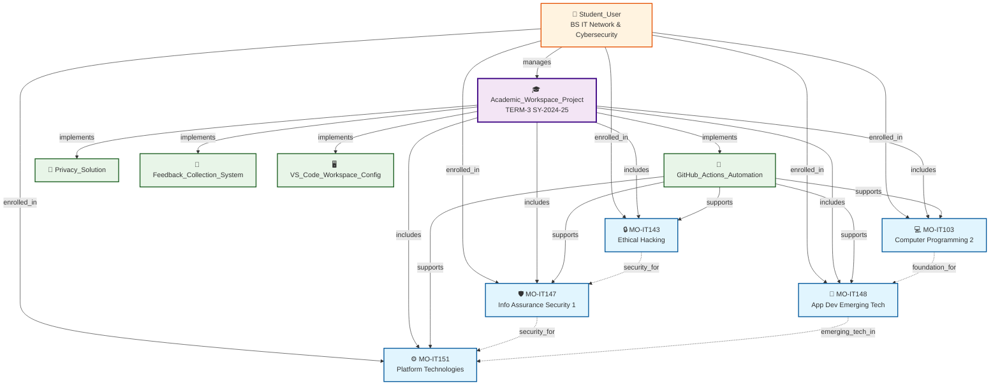

# 🧠 VS Code Copilot + MCP/Memory Knowledge Graph — Usage Instructions
## TERM-3 SY-2024-25 Academic Workspace Implementation

**Purpose**: Comprehensive guide for using MCP/Memory Knowledge Graph with VS Code Copilot  
**Last Updated**: June 3, 2025  
**Status**: Active implementation ready

---

## 📊 Knowledge Graph Visualization

The MCP Memory system creates a comprehensive knowledge graph of your academic workspace. Here's how it's structured:



### How VS Code Copilot Uses This Knowledge Graph

1. **Context Retrieval**: When you ask about a course, Copilot queries the MCP Memory to understand relationships
2. **Cross-Course Connections**: Copilot knows IT103 is foundation for IT148, so it can suggest relevant examples
3. **System Integration**: Copilot understands which automation systems support which courses
4. **Portfolio Integration**: Copilot tracks how course work feeds into your professional portfolio

---

## 1. **Memory Format**

All persistent memory is stored as JSON files, following this structure:

### **Entities**
Each entity is a node in your knowledge graph.

```json
{
  "name": "Academic_Workspace_Project",
  "entityType": "project",
  "observations": [
    "Transform GitHub and VS Code into comprehensive academic ecosystem",
    "Designed for BS IT Network & Cybersecurity TERM-3 SY-2024-25"
  ]
}
```

### **Relations**
Each relation defines a directed edge between two entities.

```json
{
  "from": "Student_User",
  "to": "Academic_Workspace_Project",
  "relationType": "manages"
}
```

### **Observations**
Observations are atomic facts about an entity.

```json
{
  "entityName": "Student_User",
  "observations": [
    "BS IT Network & Cybersecurity student",
    "Uses collaborative approach with continuous refinement",
    "Values automation and professional development integration"
  ]
}
```

---

## 2. **Directory Structure**

Your academic workspace now includes:

```
TERM-3_SY-2024-25/
│
├── mcp/
│   └── memory/
│       ├── entities.json      # All knowledge graph entities
│       ├── relations.json     # Relationships between entities
│       └── observations.json  # Additional facts about entities
│
├── .vscode/
│   └── mcp.json              # MCP server configuration
│
├── .github/
│   ├── copilot-instructions.md  # AI behavior guidelines
│   └── prompts/
│       └── copilot-prompt.md    # Reusable prompt library
│
└── mcp-memory.md             # Human-readable memory file
```

---

## 3. **MCP Memory Server API Usage**

Interact with the MCP/Memory server using these tools:

| Tool               | Description                                          | Usage Example                                                           |
|--------------------|-----------------------------------------------------|-------------------------------------------------------------------------|
| `mcp_memory_create_entities`    | Add new entities to knowledge graph        | Academic courses, projects, systems, people                           |
| `mcp_memory_create_relations`   | Connect entities with relationships        | Student enrolled_in Course, Project implements System                 |
| `mcp_memory_add_observations`   | Add facts to existing entities             | Course completion status, project milestones, skill development       |
| `mcp_memory_delete_entities`    | Remove entities and relations              | Clean up outdated or incorrect information                            |
| `mcp_memory_delete_observations`| Remove specific facts                      | Update changed information or correct mistakes                         |
| `mcp_memory_delete_relations`   | Remove relationships                       | Update organizational changes or project completions                  |
| `mcp_memory_read_graph`         | Get the complete knowledge graph          | Full context retrieval for comprehensive understanding                |
| `mcp_memory_search_nodes`       | Search entities by content                 | Find courses, projects, or concepts by keywords                       |
| `mcp_memory_open_nodes`         | Get specific entities and connections      | Detailed information about particular courses or projects             |

---

## 4. **Academic Workspace Entities Created**

### **Current Knowledge Graph Includes:**

#### **Core Entities:**
- **Academic_Workspace_Project** - Main project entity
- **Student_User** - You as the project manager
- **5 Course Entities** - MO-IT103, MO-IT143, MO-IT147, MO-IT148, MO-IT151
- **System Components** - GitHub Actions, Privacy Solution, Feedback System
- **Configuration** - Copilot Instructions and prompts

#### **Key Relations:**
- Student manages Academic Workspace Project
- Project includes all 5 courses
- Systems support and enhance the project
- User enrolled in all courses
- Automation supports all courses

#### **Rich Observations:**
- Project status and completion milestones
- Course details and portfolio requirements
- System capabilities and expected benefits
- User preferences and collaboration style
- Implementation readiness and next steps

---

## 5. **System Prompt Integration**

Your Copilot instructions now include:

> **Memory Integration**: Always begin by saying "Remembering..." and retrieve context from the knowledge graph memory. Store and update memory as entities, relations, and observations in JSON format. When new facts are discovered, create entities, connect with relations, and add observations.

### **Automatic Behaviors:**
- ✅ **Context Retrieval** - Copilot automatically accesses knowledge graph
- ✅ **Memory Updates** - New information stored systematically
- ✅ **Relationship Tracking** - Connections maintained between concepts
- ✅ **Progress Monitoring** - Academic milestones and achievements tracked

---

## 6. **Usage Examples for Academic Workspace**

### **Course Management:**
```
"Update MO-IT103 with new project completion milestone"
→ Adds observation to course entity about project progress
```

### **Portfolio Development:**
```
"Connect this new cybersecurity project to MO-IT143 and portfolio system"
→ Creates relations between project, course, and portfolio entities
```

### **Progress Tracking:**
```
"Search for all automation-related entities and their current status"
→ Uses search_nodes to find GitHub Actions, workflows, and implementation status
```

### **Collaboration Documentation:**
```
"Add feedback from team project to knowledge graph"
→ Creates new entities for collaborators and relation for feedback received
```

---

## 7. **Best Practices for Academic Use**

### **Atomic Observations:**
- Each observation should be a single, specific fact
- "Project completed June 3, 2025" not "Project mostly done around early June"

### **Consistent Naming:**
- Use course codes: "MO-IT103" not "Programming 2"
- Descriptive project names: "Cybersecurity_Risk_Assessment" not "Project1"

### **Active Voice Relations:**
- "student_enrolled_in", "project_demonstrates", "system_automates"
- Avoid passive constructions

### **Regular Updates:**
- Update after each significant milestone
- Add new projects, completions, and achievements
- Document skills developed and competencies gained

### **Academic Context:**
- Link coursework to professional development goals
- Track portfolio readiness and industry preparation
- Document collaboration and teamwork experiences

---

## 8. **Integration with Existing Workflow**

### **With GitHub Actions:**
- Automation can update knowledge graph with project completions
- Milestone achievements automatically recorded
- Portfolio updates trigger memory system updates

### **With Portfolio Development:**
- Projects linked to courses and skills demonstrated
- Professional competencies tracked across academic work
- Testimonials and feedback systematically collected

### **With Collaboration:**
- Team members and their contributions recorded
- Feedback and testimonials linked to specific projects
- Professional network development tracked

---

## 9. **Quick Start Checklist**

- [x] **Memory structure created** - JSON files in mcp/memory/
- [x] **Initial entities populated** - All 5 courses and main project
- [x] **Relations established** - Student, courses, and systems connected
- [x] **Observations added** - Key facts and progress documented
- [x] **VS Code configured** - MCP server settings updated
- [x] **Copilot integrated** - Instructions include memory management
- [ ] **First memory query** - Test retrieval with "Remembering..." prompt
- [ ] **Regular updates** - Begin adding new information systematically

---

## 10. **Troubleshooting**

### **Memory Not Loading:**
- Check `.vscode/mcp.json` configuration
- Verify JSON files are properly formatted
- Restart VS Code to reload MCP servers

### **Search Not Working:**
- Ensure observations contain searchable keywords
- Use specific terms rather than general concepts
- Check entity names for consistency

### **Relations Missing:**
- Verify both entities exist before creating relations
- Use active voice for relation types
- Check JSON formatting in relations.json

---

## 🎯 **Expected Benefits**

### **For Academic Work:**
- **Comprehensive Context** - Full project history always available
- **Automatic Documentation** - Progress tracked systematically
- **Intelligent Assistance** - Copilot understands your complete academic context
- **Efficient Recall** - Quick access to any past decisions or milestones

### **For Professional Development:**
- **Skill Tracking** - Competencies developed across all courses
- **Portfolio Building** - Projects and achievements systematically organized
- **Network Documentation** - Collaborations and testimonials tracked
- **Career Preparation** - Industry readiness continuously assessed

---

*Implementation completed: June 3, 2025*  
*Status: Ready for active use with full knowledge graph*  
*Next: Begin regular memory updates and collaborative refinement*
